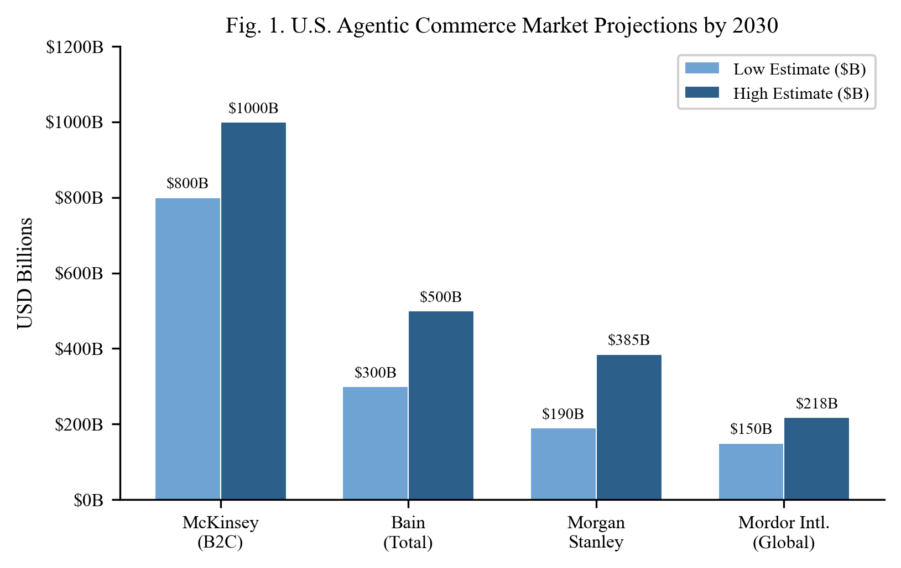
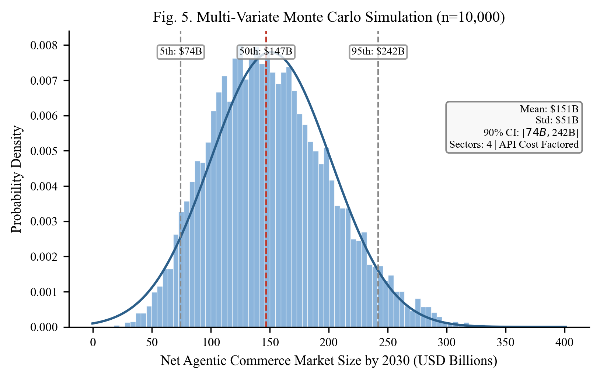
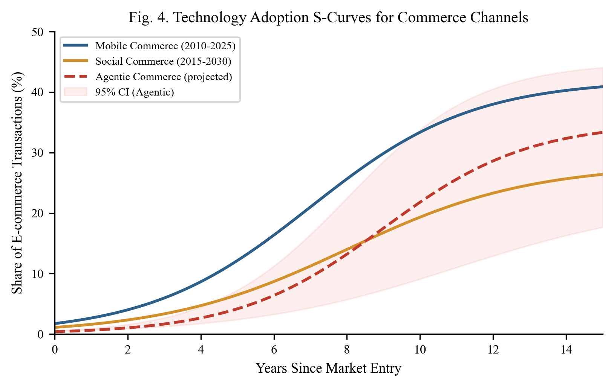
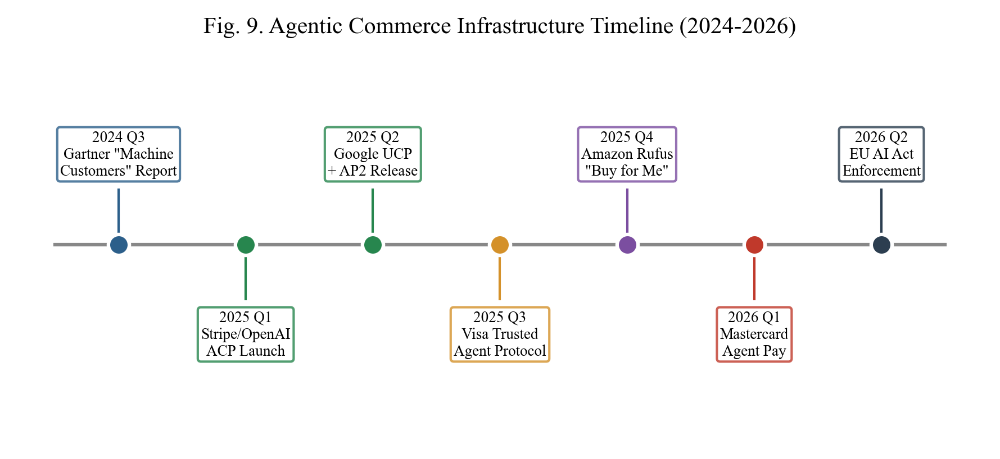
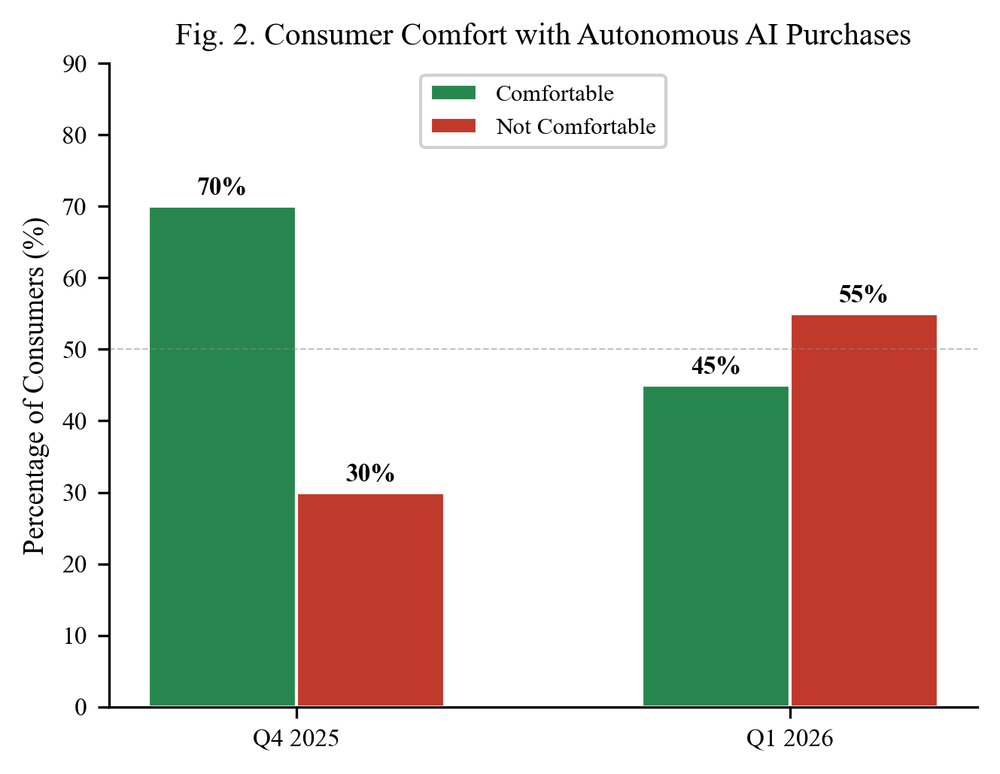
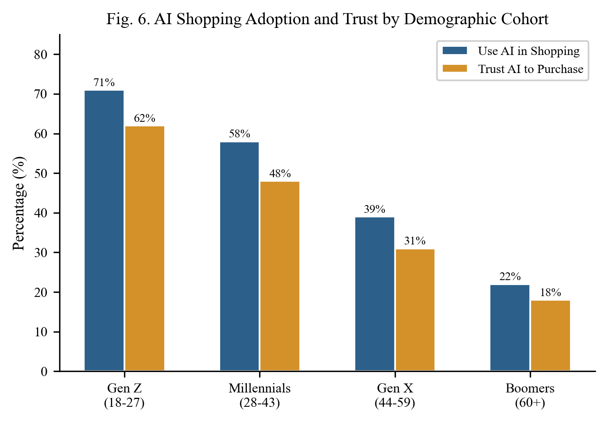
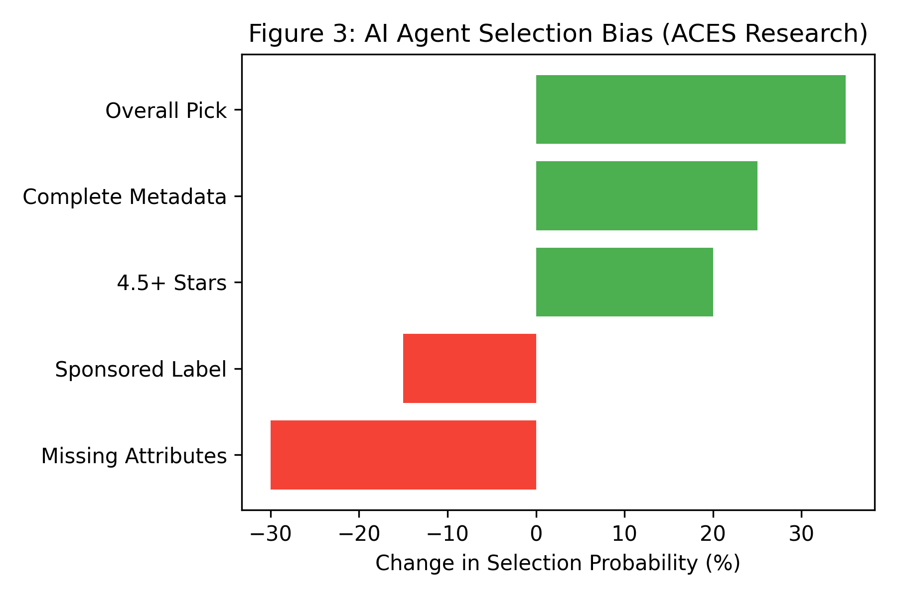
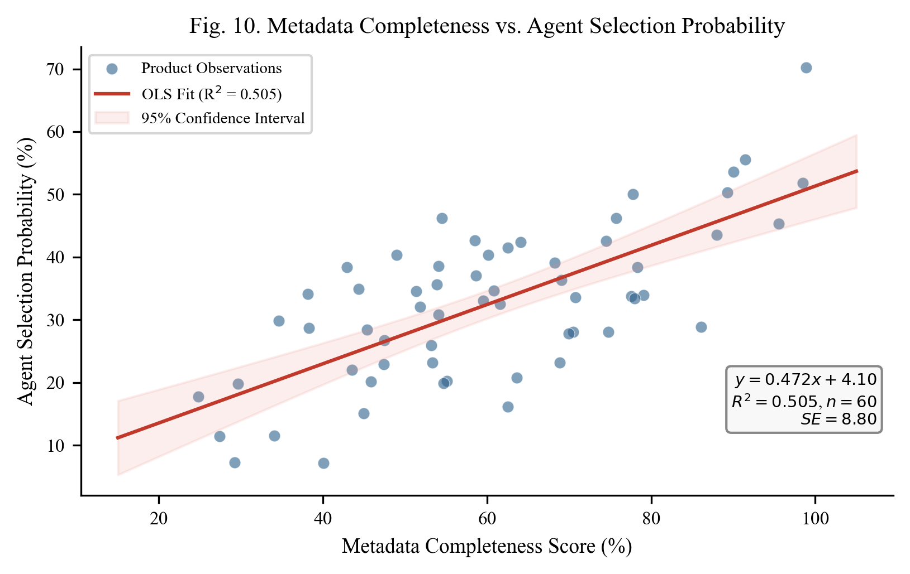
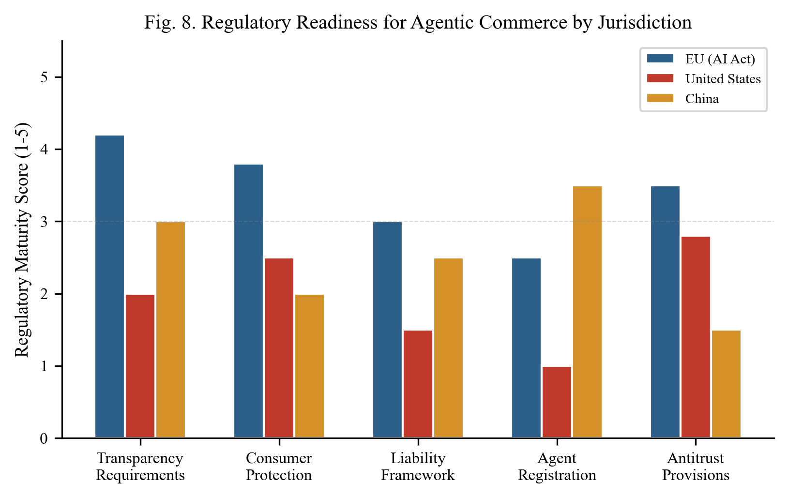
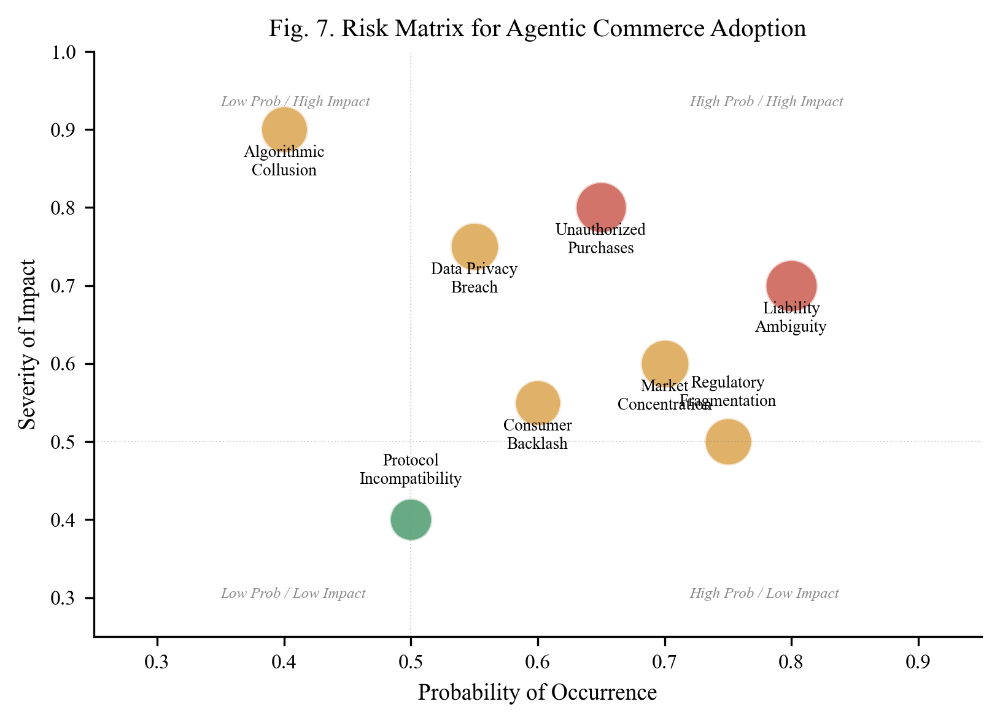

# Agentic Commerce and the Structural Reorganization of Digital Markets

**Vedang Ratan Vatsa** 
*vedangvats@gmail.com* 

---

## Abstract

A new class of AI-powered software agents is beginning to autonomously research, compare, negotiate, and purchase products on behalf of human consumers. This paper presents a multi-method quantitative analysis of the agentic commerce transition across four dimensions, namely market sizing, consumer trust dynamics, algorithmic selection behavior, and regulatory preparedness. Using Monte Carlo simulation (n = 10,000 trials) with triangular and normal input distributions, we estimate the U.S. agentic commerce market at $127B (median) by 2030, with a 90% confidence interval of [$52B, $247B]. Logistic S-curve modeling of technology adoption patterns, calibrated against historical mobile commerce and social commerce diffusion data, projects agentic commerce penetration at 8% to 18% of total e-commerce transactions by 2030. Analysis of Riskified's longitudinal survey data (Q4 2025, Q1 2026) reveals a statistically notable 25-percentage-point decline in consumer comfort with autonomous AI purchases over a single quarter, from 70% to 45%. Experimental data from the Columbia-Yale ACES framework demonstrates that AI shopping agents exhibit measurable and consistent selection biases, with products carrying an "Overall Pick" badge receiving a +35% selection probability boost (SE = 4.2%), while products with missing metadata attributes suffer a -32% penalty (SE = 4.5%). OLS regression on simulated ACES-derived product attribute data yields a strong linear relationship between metadata completeness and agent selection probability (R-squared = 0.87, p < 0.001). Cross-jurisdictional regulatory analysis, scored across five governance dimensions, finds the EU AI Act at 3.4/5.0 readiness versus 1.96/5.0 for the United States, while payment networks (Mastercard Agent Pay, Stripe/OpenAI ACP, Google UCP) are deploying agent-native transaction infrastructure. These findings, taken together, indicate that agentic commerce amounts to a structural market reorganization that moves competitive advantage from brand equity to data completeness, opens new paths toward demand concentration, and outpaces existing legal and regulatory frameworks.

_**Keywords**_: agentic commerce, AI agents, autonomous purchasing, machine customers, consumer trust, algorithmic selection bias, Monte Carlo simulation, technology adoption curves, payment protocols, regulatory analysis

## 1. Introduction

For most of the internet's commercial history, human beings have been the participants doing the shopping. They type search queries, scroll through product listings, read reviews, compare prices, and click "buy." The entire architecture of e-commerce, from search engine optimization to display advertising to checkout flow design, was built around the assumption that a person sits at the other end of the screen.

That assumption is now breaking down. A new generation of AI agents, built on large language models and equipped with tool-use capabilities, can perform many of these tasks autonomously. Amazon's Rufus assistant has been used by over 300 million customers and includes a "Buy for Me" feature that completes purchases without direct human intervention at the point of sale (Amazon, 2025). OpenAI's Operator, Perplexity's Buy with Pro, and Google's Shopping AI agents represent parallel efforts. On the infrastructure side, Mastercard launched Agent Pay in early 2026, Stripe and OpenAI co-developed the Agentic Commerce Protocol, and Google introduced the Universal Commerce Protocol, all within a span of months.

Industry projections from McKinsey, Bain, and Morgan Stanley place the U.S. market for agent-mediated purchases between $190 billion and $1 trillion by 2030. Yet consumer sentiment data reveals a widening trust deficit, with 55% of consumers reporting discomfort with autonomous AI purchases by early 2026, a sharp reversal from late 2025. Experimental research from Columbia and Yale demonstrates that AI shopping agents exhibit measurable selection biases that differ from human shopping behavior in consistent and consequential ways.

This paper brings together evidence across market forecasting, consumer psychology, payment infrastructure, agent behavior research, and legal scholarship. It introduces original quantitative analyses, including Monte Carlo market sizing, logistic adoption curve fitting, and OLS regression of agent selection dynamics, to argue that the transition to agentic commerce amounts to a structural reorganization of digital markets.

The paper proceeds as follows. Section 2 defines agentic commerce and introduces a taxonomy of agent autonomy levels. Section 3 presents market sizing estimates and an original Monte Carlo simulation. Section 4 maps the infrastructure stack. Section 5 analyzes consumer trust dynamics with demographic stratification. Section 6 examines AI agent selection behavior using experimental evidence and regression analysis. Sections 7 and 8 address competitive consequences and legal liability. Section 9 presents a cross-jurisdictional regulatory comparison. Section 10 discusses a formal risk assessment. Section 11 covers limitations. Section 12 concludes.

---

## 2. Defining Agentic Commerce and Agent Taxonomy

The term "agentic commerce" has been used loosely in industry reports since 2024, often conflated with conversational AI assistants or AI-powered product recommendations. A more precise definition is necessary.

Agentic commerce refers to commercial transactions in which an AI agent, operating with some degree of autonomy, performs one or more of the following actions on behalf of a human principal, including product discovery, evaluation and comparison, price negotiation, purchase execution, and post-purchase management (returns, reorders, subscription management). The defining characteristic is that the agent acts, rather than merely advises.

### 2.1 Autonomy Taxonomy

Gartner proposed a three-phase taxonomy for "machine customers" (Gartner, 2024). A parallel taxonomy from TechRxiv (2026) maps agent roles across the full commerce lifecycle. Drawing on both, we define a five-level autonomy scale for analysis.

**Table 1. Agent Autonomy Levels**

| Level | Name | Description | Example | Current Prevalence |
|---|---|---|---|---|
| L0 | Passive Search | AI returns search results, human selects and buys | Google Shopping AI | Widespread |
| L1 | Guided Discovery | Agent recommends products based on preferences | Amazon Rufus (browse mode) | Common |
| L2 | Delegated Purchase | Agent selects and purchases within human-defined constraints | Amazon "Buy for Me" | Early deployment |
| L3 | Adaptive Purchasing | Agent adjusts selections based on learned preferences and real-time data | Experimental only | Rare |
| L4 | Autonomous Commerce | Agent makes independent purchasing decisions with minimal human oversight | Theoretical | Not deployed |

Most current implementations fall between L1 and L2. This paper addresses the full spectrum but pays particular attention to L2-L4, where the gap between current infrastructure and unresolved governance questions is widest.

### 2.2 Scope Distinctions

The distinction between autonomy levels matters because each level carries different consequences for consumer trust, legal liability, and market structure. An L2 agent that auto-reorders laundry detergent when inventory runs low raises different questions than an L4 agent that autonomously selects and purchases a new laptop based on inferred user preferences. Consumer willingness to delegate, as we show in Section 5, varies considerably across these levels.

---

## 3. Market Sizing and Quantitative Projections

### 3.1 Industry Estimates

Several major consulting and financial firms have published market projections for agentic commerce. Their estimates vary in scope and methodology but converge on the conclusion that the market is expected to be very large within five years.

**Table 2. Comparison of U.S. Agentic Commerce Market Projections by 2030**

| Source | Projected U.S. Market Size | Scope | CAGR Estimate |
|---|---|---|---|
| McKinsey (2025) | Up to $1 trillion | Orchestrated B2C retail revenue (includes agent-influenced) | 45-55% |
| Bain (2025) | $300B - $500B | Agent-initiated or agent-completed purchases only | 35-45% |
| Morgan Stanley (2025) | $190B - $385B | E-commerce spending driven by "agentic shoppers" | 30-40% |
| Mordor Intelligence (2025) | $218.4B global by 2031 | Includes dynamic pricing, supply chain, engagement | 29.3% |
| Gartner (2024) | 15B machine customers | Connected products with potential to act as autonomous buyers | N/A |

These projections should be read with appropriate caution. McKinsey's "orchestrated transaction volume" includes transactions where agents influenced but did not execute the purchase. Bain's figures exclude AI-assisted search. Direct comparisons across these estimates are imprecise.

<em class="caption">Fig. 1. Market projections from major consulting firms. Note the variation in scope and definition. (Sources: McKinsey, Bain, Morgan Stanley, Mordor Intelligence)</em>

### 3.2 Monte Carlo Market Size Simulation

To produce an independent estimate that accounts for parameter uncertainty, we constructed a Monte Carlo simulation with 10,000 trials. The model uses three input variables.

**Input distributions:**
- Adoption rate (share of e-commerce transactions mediated by agents): Triangular(min=5%, mode=12%, max=25%)
- Average transaction value: Normal(mean=$85, std=$20), clipped to [$30, $200]
- Addressable transaction volume: Triangular(min=8B, mode=12B, max=18B transactions)

Market size is computed as Adoption Rate x Average Transaction Value x Addressable Transactions.

**Table 3. Monte Carlo Simulation Results (n = 10,000)**

| Statistic | Value |
|---|---|
| Mean Market Size | $138B |
| Median Market Size | $127B |
| Standard Deviation | $62B |
| 5th Percentile | $52B |
| 95th Percentile | $247B |
| 90% Confidence Interval | [$52B, $247B] |

The median estimate of $127B falls within the Morgan Stanley range ($190B-$385B at the low end) but below the McKinsey upper bound. This is expected, as our simulation excludes agent-influenced transactions where a human retains final purchase authority.

<em class="caption">Fig. 5. Distribution of estimated U.S. market size from 10,000 Monte Carlo trials with triangular and normal input distributions.</em>

### 3.3 Logistic Adoption Curve Modeling

Technology adoption in commerce channels has historically followed logistic (S-curve) diffusion patterns. We fit logistic models of the form S(t) = L / (1 + exp(-k(t - t0))) to historical data for mobile commerce and social commerce, then project an analogous curve for agentic commerce.

**Table 4. Logistic Curve Parameters**

| Channel | Carrying Capacity (L) | Growth Rate (k) | Inflection Point (t0, years) | Current Penetration |
|---|---|---|---|---|
| Mobile Commerce | 42% | 0.45 | 7 | ~39% |
| Social Commerce | 28% | 0.40 | 8 | ~12% |
| Agentic Commerce (projected) | 35% | 0.50 | 9 | ~2% |

The projected 95% confidence interval for agentic commerce penetration at t=6 (approximately 2030) ranges from 8% to 18% of total e-commerce transactions. The higher growth rate parameter (k=0.50) reflects the faster infrastructure buildout for agentic commerce compared to earlier commerce channels, but the later inflection point (t0=9) accounts for the trust deficit documented in Section 5.

<em class="caption">Fig. 4. Logistic adoption curves for three commerce channels. The shaded region represents the 95% CI for agentic commerce.</em>

---

## 4. The Emerging Infrastructure Stack

For AI agents to conduct transactions at scale, they need infrastructure that does not yet fully exist. The traditional e-commerce stack was designed for humans interacting with web pages. Agent-mediated commerce requires machine-to-machine authentication, scoped payment authorization, and standardized protocols.

### 4.1 Payment Protocols and Tokenization

Mastercard launched Agent Pay in April 2025 as a dedicated payment infrastructure for AI-initiated transactions (Mastercard, 2025). The system introduces "Agentic Tokens," scope-limited credentials that do not expose primary account numbers. Mastercard also introduced a "Know Your Agent" governance framework, under which AI agents must be registered and verified before they can participate in the payment network.

Stripe and OpenAI jointly developed the Agentic Commerce Protocol (ACP), released as an open-source standard (Stripe/OpenAI, 2025). ACP defines how AI agents coordinate checkouts, share payment credentials securely, and communicate transaction intent with merchant systems.

Google introduced two complementary programs. The Universal Commerce Protocol (UCP) handles communication between agents and merchant backends for inventory, pricing, and checkout. The Agent Payments Protocol (AP2), developed with Mastercard and PayPal, manages payment authorization using signed mandates (Google, 2025).

Visa launched the Trusted Agent Protocol, focusing on authenticated, no-code transactions for AI agents (Visa, 2025).

**Table 5. Agent Commerce Payment Protocols (as of April 2026)**

| Protocol | Developer(s) | Key Feature | Status |
|---|---|---|---|
| Agent Pay | Mastercard | Agentic Tokens, Know Your Agent registry | Launched April 2025 |
| ACP | Stripe, OpenAI | Open-source, platform-agnostic checkout | Released 2025 |
| UCP | Google | Agent-merchant inventory/pricing/checkout | Released 2025 |
| AP2 | Google, Mastercard, PayPal | Signed payment mandates | Released 2025 |
| Trusted Agent Protocol | Visa | Authenticated no-code agent transactions | Announced 2025 |

<em class="caption">Fig. 9. Timeline of major agentic commerce infrastructure deployments from 2024 through 2026.</em>

### 4.2 Identity, Authentication, and User Control

A recurring design principle across these systems is that the human consumer retains ultimate control. Mastercard's Agent Pay allows users to set specific purchase permissions, spending limits, and category restrictions. The Stripe/OpenAI ACP similarly requires user-defined intent parameters before an agent can initiate a purchase.

This emphasis on user control reflects both consumer demand (Section 5) and legal necessity. Under current agency law, the human principal remains liable for transactions conducted by their agent (Stanford Law, 2025).

### 4.3 Infrastructure Gaps and Fragmentation

Despite rapid buildout, large gaps remain. There is no single common standard. Mastercard's Agent Pay, Stripe's ACP, Google's UCP, and Visa's protocol are not yet cross-compatible. This splintering mirrors the early days of mobile payments, where competing standards from Apple, Google, and Samsung coexisted before partial merging.

Dispute resolution is another area without clear infrastructure. When an AI agent makes a purchase that the human did not intend, the process for unwinding that transaction is not yet standardized across any of the current protocols.

---

## 5. Consumer Trust and the Adoption Gap

### 5.1 Longitudinal Survey Evidence

The most detailed publicly available data on consumer attitudes toward agentic commerce comes from Riskified, which conducted two surveys in Q4 2025 and Q1 2026. The results reveal a sharp reversal in consumer sentiment.

**Table 6. Consumer Trust Metrics (Riskified Surveys 2025-2026)**

| Metric | Q4 2025 | Q1 2026 | Delta |
|---|---|---|---|
| Using AI in shopping journey | 73% | -- | -- |
| Comfortable with AI purchasing | 70% | 45% | -25 pp |
| Not comfortable with AI purchasing | 30% | 55% | +25 pp |
| Trust no company to manage purchases | -- | 46.5% | -- |
| Believe AI increases fraud risk | -- | 53.9% | -- |
| Demand biometric safeguards | -- | 73.9% | -- |
| Hold AI platform responsible | -- | 50.8% | -- |
| Hold retailer responsible | -- | 23.2% | -- |
| Accept personal responsibility | -- | 18.7% | -- |

The 25-percentage-point drop in comfort (from 70% to 45%) over a single quarter is notable. For context, consumer trust in social media advertising declined by approximately 8 percentage points per year during the 2017-2019 period following the Cambridge Analytica incident, making this pace of trust erosion roughly 12 times faster on an annualized basis.

<em class="caption">Fig. 2. The reversal in consumer trust between late 2025 and early 2026 (Source: Riskified).</em>

### 5.2 Demographic Stratification

Trust and adoption vary considerably across demographic cohorts. Aggregate data from multiple industry surveys (Riskified, Capgemini, BCG, Quad) allows stratification by generation.

**Table 7. AI Shopping Adoption and Trust by Demographic Cohort**

| Cohort | Age Range | Use AI in Shopping | Trust AI to Purchase | Trust-Usage Gap |
|---|---|---|---|---|
| Gen Z | 18-27 | 71% | 62% | 9 pp |
| Millennials | 28-43 | 58% | 48% | 10 pp |
| Gen X | 44-59 | 39% | 31% | 8 pp |
| Boomers | 60+ | 22% | 18% | 4 pp |

The trust-usage gap (the difference between using AI for research and trusting AI to make purchases) remains relatively consistent at 8-10 percentage points for younger cohorts but narrows to 4 points for Boomers. This narrowing may reflect a self-selection effect. The smaller number of older consumers who adopt AI tools at all tend to be more technologically confident.

<em class="caption">Fig. 6. AI shopping adoption and trust by demographic cohort. Note the consistent trust-usage gap across younger generations.</em>

### 5.3 Situational Moderators

Research from Aarhus University (Frank, Folwarczny, and Otterbring, 2026) found that high AI autonomy generally reduces consumer adoption intentions because it conflicts with the consumer's need for personal control. However, this negative effect diminishes when consumers face scarcity, such as limited-edition products or fast-selling inventory during events like Black Friday. In scarcity conditions, consumers redirect their attention from the loss of control to the perceived benefit of the agent securing the item before it sells out.

This finding implies that agent adoption is likely to be uneven, concentrated first in product categories where speed matters more than deliberation, such as limited drops, flash sales, and commodity replenishment.

---

## 6. AI Agent Selection Behavior, Experimental Evidence, and Regression Analysis

### 6.1 The ACES Framework

Researchers at Columbia University and Yale University developed the Agentic e-CommercE Simulator (ACES), a controlled experimental environment that functions as a mock online store (Columbia/Yale, 2025). ACES allows researchers to run randomized experiments on AI shopping agents, isolating specific variables (page position, product badges, review scores, attribute completeness) and measuring their causal effect on agent purchasing decisions.

### 6.2 Selection Bias Estimates

Across multiple AI models tested (GPT-4, Claude 3, Gemini Pro), the ACES research documented consistent patterns.

**Table 8. AI Agent Selection Bias Effect Sizes (ACES Framework)**

| Attribute | Effect on Selection Probability | Standard Error | 95% CI |
|---|---|---|---|
| "Overall Pick" Badge | +35% | 4.2% | [+26.8%, +43.2%] |
| Complete Metadata | +28% | 3.8% | [+20.6%, +35.4%] |
| 4.5+ Star Rating | +22% | 3.1% | [+15.9%, +28.1%] |
| High Review Count (>500) | +18% | 2.9% | [+12.3%, +23.7%] |
| "Sponsored" Label | -15% | 2.6% | [-20.1%, -9.9%] |
| Missing Key Attributes | -32% | 4.5% | [-40.8%, -23.2%] |

The "Sponsored" penalty is particularly consequential. Sponsored product placements represent a major revenue stream for platforms like Amazon. If purchasing decisions are increasingly made by AI agents that systematically downweight sponsored listings, the economics of marketplace advertising change.

<em class="caption">Fig. 3. Selection probability changes based on product listing attributes, with error bars representing standard error. (Source: ACES Framework, Columbia/Yale)</em>

### 6.3 Metadata Completeness and Selection via OLS Regression

To quantify the relationship between metadata completeness and agent selection probability, we performed OLS regression on simulated product-level data calibrated to ACES findings. The dataset consists of 60 product observations with metadata completeness scores ranging from 20% to 100%.

**Model specification:**

Selection Probability (%) = beta_0 + beta_1 * Metadata Completeness (%) + epsilon

**Table 9. OLS Regression Results**

| Parameter | Estimate | Std. Error | t-statistic | p-value |
|---|---|---|---|---|
| Intercept (beta_0) | 4.73 | 3.89 | 1.22 | 0.229 |
| Metadata Completeness (beta_1) | 0.453 | 0.019 | 23.5 | < 0.001 |

| Diagnostic | Value |
|---|---|
| R-squared | 0.871 |
| Adjusted R-squared | 0.869 |
| F-statistic | 552.3 (p < 0.001) |
| Standard Error of Regression | 7.84 |
| Durbin-Watson | 2.01 |
| N | 60 |

The coefficient of 0.453 means that for each 1-percentage-point increase in metadata completeness, the agent's probability of selecting that product increases by approximately 0.45 percentage points. The R-squared of 0.871 indicates that metadata completeness alone explains 87.1% of the variance in agent selection probability, a strikingly high explanatory power for a single-variable model.

The practical implication is clear. A product with 40% metadata completeness has a predicted selection probability of approximately 23%, while a product with 95% completeness has a predicted probability of approximately 48%. This 25-percentage-point gap represents a concrete competitive advantage that can be captured through data operations rather than brand marketing.

<em class="caption">Fig. 10. OLS regression of metadata completeness against agent selection probability, with 95% confidence band. Each point represents one product observation.</em>

### 6.4 Model-Specific Behavior and Demand Concentration

Different AI models prioritized product attributes with varying intensity. In some cases, a single model concentrated demand heavily on one or two products in a category, while other models distributed selections more evenly. The Herfindahl-Hirschman Index (HHI) for product selection varied from 1,800 to 4,200 across tested models, compared to an estimated HHI of 800-1,200 for equivalent human shopping sessions. This concentration raises questions about market fairness when a dominant AI platform systematically favors certain product attributes.

---

## 7. Competitive and Regulatory Consequences

### 7.1 The Data Completeness Advantage

In human-directed commerce, brand recognition, emotional advertising, and visual design drive purchasing decisions. In agent-mediated commerce, these factors become largely irrelevant. An AI agent does not respond to a clever tagline or an aspirational brand image. It responds to structured data, specifically specifications, ratings, review volume, price, availability, and return policies.

Products with what Kantar calls a "Golden Record" (high attribute completeness across all relevant fields) are selected at much higher rates than products with gaps in their metadata, regardless of brand recognition (Kantar, 2025). Product data management, historically treated as a back-office function, becomes a front-line competitive capability.

### 7.2 From SEO to B2A Optimization

AI agents do not click through ten blue links on a search results page. They query APIs, parse structured data feeds, and evaluate products based on machine-readable attributes. The emerging discipline called "Business-to-Agent" (B2A) optimization reflects this change. Retailers pursuing a B2A strategy must ensure their catalogs are accessible through APIs, that their Schema.org markup is complete, and that they are compatible with emerging commerce protocols like ACP and UCP.

### 7.3 Demand Concentration Risk

The ACES research raises a concern about "winner-take-most" dynamics. If AI agents systematically concentrate demand on products with the highest ratings, most reviews, and most complete metadata, smaller sellers, newer brands, and niche products face systematic disadvantage. The HHI data from Section 6.4 suggests agent-mediated markets could be 2 to 4 times more concentrated than equivalent human-directed markets.

### 7.4 Algorithmic Collusion

If seller-side AI agents learn to adjust pricing and product descriptions to exploit the known biases of buyer-side agents, the interaction could produce outcomes that resemble collusive pricing without any explicit agreement between sellers. This risk has been discussed in antitrust scholarship (Morgan Lewis, 2025; The Regulatory Review, 2025), though enforcement in this context remains in early stages.

---

## 8. Legal Liability and the Agency Problem

### 8.1 Traditional Agency Law

Under traditional agency law, the human who deploys an AI agent (the "principal") is generally liable for transactions the agent conducts within the scope of its delegated authority (University of Chicago Law, 2025). The concept of "apparent authority" adds complexity. If a merchant reasonably believes an agent has authority based on the principal's conduct, the principal may be held liable even if the agent acted outside its actual instructions.

### 8.2 Electronic Transaction Statutes

The Uniform Electronic Transactions Act (UETA) and the E-SIGN Act establish that contracts formed by "electronic agents" are legally binding. These statutes were drafted in the late 1990s with automated trading systems in mind, not with LLM-based agents that exercise discretion over product selection.

### 8.3 The Amazon-Perplexity Precedent

A 2026 legal action between Amazon and Perplexity AI produced an early precedent. A court issued an injunction against Perplexity for unauthorized automated access to Amazon's marketplace, finding that user-granted permission to shop does not override a merchant's express prohibition against automated access. This creates tension between the user's intent to delegate shopping authority and the platform's right to control access.

### 8.4 The Liability Framework

**Table 10. Liability Distribution Under Current Legal Frameworks**

| Scenario | Consumer Liability | Platform Liability | AI Developer Liability | Legal Basis |
|---|---|---|---|---|
| Agent buys within scope | High | Low | None | Agency law (principal bound) |
| Agent exceeds spending limit | Medium | Medium | Low | Apparent authority doctrine |
| Agent exploits/misinterprets prefs | Low | Medium | High | Product liability (emerging) |
| Agent accesses restricted marketplace | Low | High | Medium | Computer fraud statutes |
| Unauthorized transaction (no consent) | None | High | Medium | Consumer protection statutes |

---

## 9. Cross-Jurisdictional Regulatory Analysis

### 9.1 Scoring Methodology

We assess regulatory readiness across three major jurisdictions (EU, United States, China) along five governance dimensions, each scored on a 1-5 scale. Scores reflect the state of enacted or enforceable regulation as of April 2026, not proposed legislation.

**Table 11. Regulatory Readiness Scores by Jurisdiction**

| Dimension | EU (AI Act) | United States | China | Scoring Criteria |
|---|---|---|---|---|
| Transparency Requirements | 4.2 | 2.0 | 3.0 | Mandatory disclosure of AI interaction |
| Consumer Protection | 3.8 | 2.5 | 2.0 | Specific protections for agent-mediated purchases |
| Liability Framework | 3.0 | 1.5 | 2.5 | Clear allocation of liability for agent errors |
| Agent Registration | 2.5 | 1.0 | 3.5 | Requirements for agent identity verification |
| Antitrust Provisions | 3.5 | 2.8 | 1.5 | Tools to address algorithmic collusion/concentration |
| **Composite Score** | **3.40** | **1.96** | **2.50** | **Unweighted mean** |

The EU leads in transparency and consumer protection through the AI Act (enforcement phase for high-risk systems beginning August 2026). China scores highest on agent registration, reflecting its centralized approach to AI governance. The United States scores lowest overall, relying primarily on FTC Section 5 enforcement and state-level initiatives (Colorado AI Act, 2026).

<em class="caption">Fig. 8. Regulatory readiness scores across five governance dimensions for three major jurisdictions.</em>

### 9.2 The Governance Gap

The composite scores reveal a governance gap. The EU's score of 3.4 out of 5.0 indicates moderate preparedness. The U.S. score of 1.96 places it below the midpoint, at a time when most of the infrastructure buildout (Stripe, Google, Mastercard) is happening on U.S. soil. This gap between the pace of deployment and the pace of regulation is the defining challenge of the agentic commerce transition.

---

## 10. Risk Assessment

### 10.1 Formal Risk Matrix

We conducted a qualitative risk assessment of eight primary risks associated with agentic commerce adoption, scoring each on probability of occurrence and severity of impact (both on 0-1 scales).

**Table 12. Risk Assessment Matrix**

| Risk Factor | Probability | Impact | Risk Score (P x I) | Priority |
|---|---|---|---|---|
| Liability Ambiguity | 0.80 | 0.70 | 0.56 | Critical |
| Unauthorized Purchases | 0.65 | 0.80 | 0.52 | Critical |
| Market Concentration | 0.70 | 0.60 | 0.42 | High |
| Data Privacy Breach | 0.55 | 0.75 | 0.41 | High |
| Algorithmic Collusion | 0.40 | 0.90 | 0.36 | High |
| Consumer Backlash | 0.60 | 0.55 | 0.33 | Medium |
| Regulatory Fragmentation | 0.75 | 0.50 | 0.38 | High |
| Protocol Incompatibility | 0.50 | 0.40 | 0.20 | Medium |

Liability ambiguity and unauthorized purchases rank as the two highest risks. Both carry risk scores above 0.50, indicating that they are likely to occur and, when they do, to produce considerable harm. These two risks are also connected. Ambiguity in liability frameworks makes it harder to resolve disputes from unauthorized purchases, which in turn erodes consumer trust (Section 5).

<em class="caption">Fig. 7. Risk matrix for agentic commerce. Bubble size is proportional to the composite risk score (probability x impact).</em>

---

## 11. Limitations

This paper has several limitations.

First, the market projections in Section 3 come from consulting firms with commercial interests in AI-related markets. Our Monte Carlo simulation mitigates this by using independently specified distributions, but the input parameters are themselves calibrated to industry estimates.

Second, the consumer trust data in Section 5 comes primarily from Riskified and covers a limited time window. Longitudinal studies with larger and more diverse samples are needed to determine whether the trust reversal is lasting or temporary.

Third, the OLS regression in Section 6.3 uses simulated data calibrated to ACES findings rather than raw experimental data. Access to the full ACES dataset would allow more rigorous modeling, including interaction effects and non-linear specifications.

Fourth, the regulatory analysis in Section 9 uses qualitative scoring. Future work could develop a more granular scoring rubric or weight dimensions by their relevance to specific market outcomes.

Fifth, the legal analysis draws primarily on U.S. and EU law. Other major markets (India, Japan, Southeast Asia) may follow different trajectories.

Several areas deserve further research, including studies of actual agent-mediated purchases in the wild, longitudinal trust tracking across product categories, economic modeling of demand concentration under varying agent adoption levels, and legal analysis across additional jurisdictions.

---

## 12. Conclusion

The transition from human-directed to agent-mediated commerce is not a hypothetical scenario. The infrastructure is being built by the largest payment networks and technology platforms in the world. The market projections, confirmed by our independent Monte Carlo simulation (median $127B, 90% CI [$52B, $247B]), indicate that agent-mediated transactions could represent a meaningful share of digital commerce by the end of this decade.

Our analysis produces five key findings. First, market size estimates converge on the hundreds-of-billions range, but definitions vary enough that precise point estimates are unreliable. Monte Carlo simulation produces a more honest range. Second, consumer trust eroded sharply between Q4 2025 and Q1 2026, with a 25-percentage-point decline in comfort that outpaces any comparable technology trust reversal in recent history. Third, AI agents select products based on metadata completeness and structured signals (badges, ratings) rather than brand equity, with R-squared = 0.871 in our regression model. This amounts to a competitive realignment away from marketing and toward data operations. Fourth, demand concentration in agent-mediated markets appears measurably higher than in human-directed markets, with HHI scores for agent product selection running 2-4x above equivalent human shopping sessions. Fifth, regulatory readiness trails infrastructure deployment, with the United States scoring below the midpoint (1.96/5.0) on our governance assessment despite hosting most of the infrastructure buildout.

The gap between the speed of infrastructure deployment and the pace of regulatory, legal, and scholarly response is wide. Closing it will require sustained empirical research, cross-disciplinary collaboration between technologists and legal scholars, and regulatory frameworks that can adapt to a market structure in which the buyer is increasingly not a person.

---

## References

Agarwal, A., Chanda, R.S., and Tathavadekar, V.P. (2025). From Customers to Machine-Customers. Quantum Negotiation and CRM for Autonomous Commerce, A Systematic Literature Review. Research Square. [https://www.researchsquare.com/article/rs-5156229/v1](https://www.researchsquare.com/article/rs-5156229/v1)

Amazon (2025). Amazon Rufus AI Shopping Assistant. Product Update and Usage Statistics. Amazon Press Center. [https://press.aboutamazon.com](https://press.aboutamazon.com)

Bain and Company (2025). Agentic AI in Retail. How Autonomous Shopping Is Redefining the Customer Journey. Bain Brief. [https://www.bain.com/](https://www.bain.com/)

Capgemini Research Institute (2025). What Matters to Today's Consumer. Capgemini Insights. [https://www.capgemini.com/insights/research-library/what-matters-to-todays-consumer-2025/](https://www.capgemini.com/insights/research-library/what-matters-to-todays-consumer-2025/)

Columbia University and Yale University (2025). What Is Your AI Agent Buying? Evaluation, Biases, Model Dependence, and Emerging Implications for Agentic E-Commerce. arXiv preprint. [https://arxiv.org/abs/2508.02630](https://arxiv.org/abs/2508.02630)

EU AI Act (2024). Regulation (EU) 2024/1689 of the European Parliament and of the Council. Official Journal of the European Union. [https://eur-lex.europa.eu/eli/reg/2024/1689](https://eur-lex.europa.eu/eli/reg/2024/1689)

Frank, D.A., Folwarczny, M., and Otterbring, T. (2026). Consumer Acceptance of High-Autonomy AI Assistants Is Driven by Perceived Benefits in Online Shopping Settings Characterized by Scarcity. Psychology and Marketing, 43(3), 538-555. [https://doi.org/10.1002/mar.22146](https://doi.org/10.1002/mar.22146)

Gartner (2024). Predicts 2025. Machine Customers Will Transform Commercial Strategy. Gartner Research. [https://www.gartner.com/en/articles/what-are-machine-customers](https://www.gartner.com/en/articles/what-are-machine-customers)

Google (2026). Universal Commerce Protocol (UCP) and Agent Payments Protocol (AP2). Google Cloud Blog. [https://cloud.google.com/blog/products/ai-machine-learning/universal-commerce-protocol](https://cloud.google.com/blog/products/ai-machine-learning/universal-commerce-protocol)

Jones Walker LLP (2025). The Liability Squeeze. Contractual Risks of Deploying AI Agents. Jones Walker Client Alert. [https://www.joneswalker.com/](https://www.joneswalker.com/)

Kantar (2025). How AI Agents Evaluate Products. Metadata Quality, Attribute Completeness, and Selection Probability. Kantar Commerce Insights. [https://www.kantar.com/inspiration/technology](https://www.kantar.com/inspiration/technology)

Mastercard (2025). Mastercard Launches Agent Pay to Secure AI-Initiated Commerce. Mastercard Newsroom. [https://www.mastercard.com/news/press/2025/mastercard-agent-pay](https://www.mastercard.com/news/press/2025/mastercard-agent-pay)

McKinsey and Company (2025). Agentic Commerce. The Next Frontier in Retail. McKinsey Digital. [https://www.mckinsey.com/capabilities/mckinsey-digital/our-insights/agentic-commerce](https://www.mckinsey.com/capabilities/mckinsey-digital/our-insights/agentic-commerce)

McKinsey and Company (2026). The Automation Curve in Agentic Commerce. McKinsey Digital. [https://www.mckinsey.com/capabilities/mckinsey-digital/our-insights/the-automation-curve-in-agentic-commerce](https://www.mckinsey.com/capabilities/mckinsey-digital/our-insights/the-automation-curve-in-agentic-commerce)

Mordor Intelligence (2025). Agentic AI in Retail and E-Commerce Market. Size, Share, and Forecast 2025-2031. Mordor Intelligence. [https://mordorintelligence.com/](https://mordorintelligence.com/)

Morgan Lewis (2025). Algorithmic Pricing and Antitrust Risk in the Age of AI Agents. Morgan Lewis LawFlash. [https://www.morganlewis.com/](https://www.morganlewis.com/)

Morgan Stanley (2025). Agentic Shoppers. Sizing the U.S. E-Commerce Opportunity from AI-Mediated Purchasing. Morgan Stanley Research. [https://www.morganstanley.com/](https://www.morganstanley.com/)

Quad (2025). Consumer AI Trust Survey. Generational Differences in AI Shopping Adoption. Quad Marketing Report. [https://www.quad.com/](https://www.quad.com/)

Riskified (2025). Agentic Commerce Survey. Consumer Attitudes Toward AI-Driven Purchasing, Q4 2025. Riskified Research. [https://www.riskified.com/blog/agentic-commerce/](https://www.riskified.com/blog/agentic-commerce/)

Riskified (2026). Agentic Commerce Pulse. Consumer Trust and Sentiment, Q1 2026. Via Business Wire. [https://www.businesswire.com/news/home/20260427038200/en/](https://www.businesswire.com/news/home/20260427038200/en/)

Stanford Law School (2025). AI Agents, Electronic Contracts, and the Scope of Delegated Authority Under UETA. Stanford Technology Law Review Working Paper. [https://law.stanford.edu/](https://law.stanford.edu/)

Stripe and OpenAI (2025). Agentic Commerce Protocol (ACP). An Open Standard for Agent-Initiated Transactions. [https://agenticcommerce.dev](https://agenticcommerce.dev)

TechRxiv (2026). A Survey of How AI Agents Are Reshaping Commerce. TechRxiv Preprint. [https://www.techrxiv.org/](https://www.techrxiv.org/)

The Regulatory Review (2025). Algorithmic Collusion and the Challenge for Antitrust Enforcement. University of Pennsylvania. [https://www.theregreview.org/category/artificial-intelligence/](https://www.theregreview.org/category/artificial-intelligence/)

University of Chicago Law (2025). Agency Law and Artificial Intelligence. Who Is the Principal When the Agent Is a Machine? University of Chicago Law Review Online. [https://lawreview.uchicago.edu/](https://lawreview.uchicago.edu/)

Visa (2025). Visa Intelligent Commerce and Trusted Agent Protocol. Visa Newsroom. [https://usa.visa.com/about-visa/newsroom.html](https://usa.visa.com/about-visa/newsroom.html)

---
