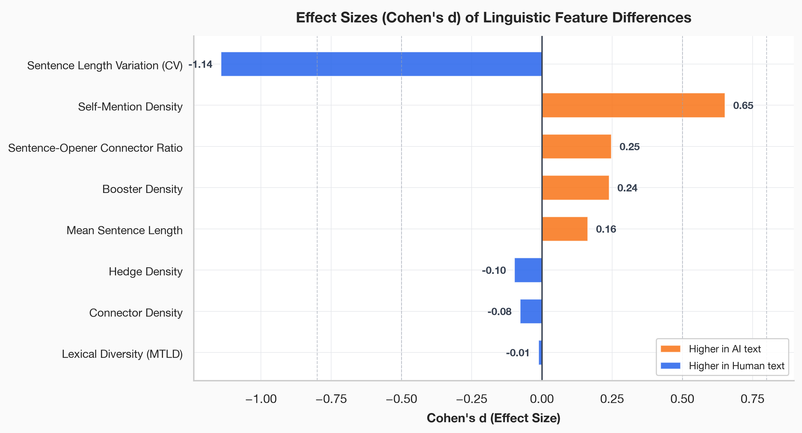
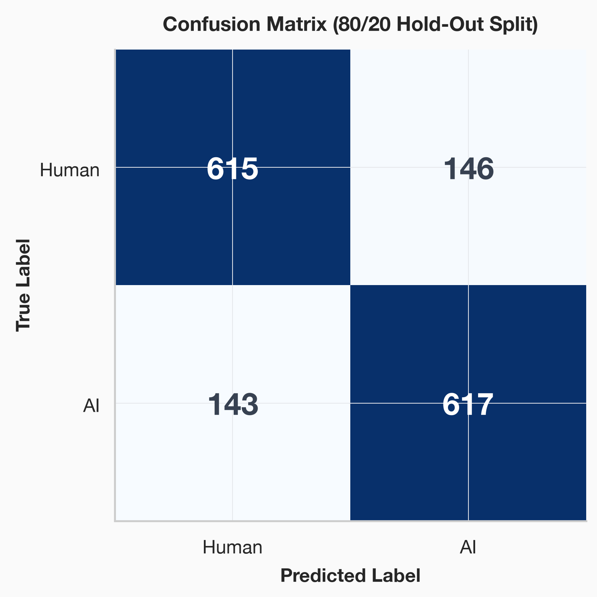
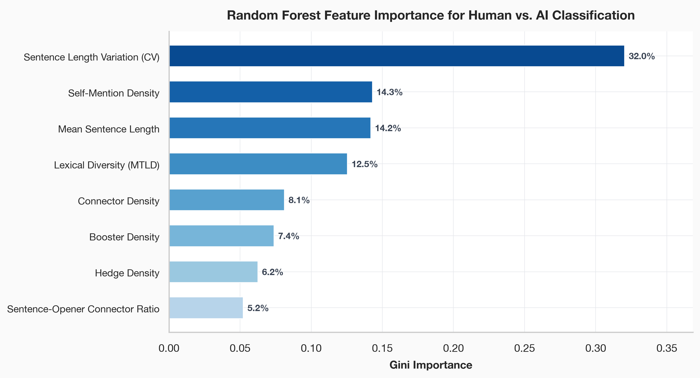

# Detecting AI-Written Research Abstracts using Linguistic Markers

**Author** Vedang Vatsa  
**Affiliation** Independent Researcher  
**Contact** contact@veda.ng  

## Abstract

The rapid growth of Large Language Models (LLMs) in academia has created a need for clear methods to tell human-authored scientific text from machine-generated writing. While complex neural classifiers achieve high accuracy, they do not explain their decisions and can be bypassed by simple edits. This study looks at whether a small set of easy-to-understand features from language study and style analysis can identify the writing style of machine-generated scientific abstracts. A balanced dataset of 10,000 academic abstracts was analyzed, which included 5,000 human-written abstracts and 5,000 machine-written abstracts from a pipeline of three model families (LLaMA, Command-R, and Minimax-M3). Eight features were measured, including vocabulary variety, sentence length variation, and the use of connecting or signaling words. The analysis shows that AI-generated text has less variety in sentence length and uses more first-person pronouns like "we" than human writing. A simple classifier achieved an accuracy of 79.01% with sentence length variation as the most important feature. These findings suggest that AI-generated scientific text has a distinct writing style that can be detected using simple language features.

_**Keywords**_ LLM detection, corpus linguistics, metadiscourse, stylometrics, lexical diversity, scientific register.

## 1. Introduction

The release of consumer-accessible Large Language Models has changed the academic publishing landscape. While these tools offer helpful support for language editing and brainstorming, their ability to generate clear and well-structured scientific text has raised concerns about academic honesty, fake paper generation, and the overall quality of research papers [4, 5]. In the past, writing a scientific paper required deep knowledge of the subject and years of practice in academic writing. Now, anyone with access to an advanced computer program can produce text that looks like a professional scientific document. This shift forces the academic community to rethink how it handles peer review and checks for originality. The ease of generating text means that conferences and journals receive more submissions than ever before, but reviewers struggle to tell which papers are authentic.

Current detection tools fall into two main groups, which are deep learning classifiers and probability indicators. Although these tools perform well on standard test sets, they have two main drawbacks.

1. **Lack of Interpretability.** These tools do not explain their decisions. This makes them difficult to use when an institution needs to make a formal decision about a student or researcher [6]. A tool that cannot explain why a text looks generated has limited value in hearings. When a student is accused of academic dishonesty, a simple percentage score from a machine learning model is not enough evidence. Committees need clear examples of how the writing differs from normal human patterns. Without explainable evidence, universities hesitate to enforce rules because they fear false accusations and legal challenges. This creates a gap between the availability of detection tools and their actual usefulness in real-world settings.

2. **Adversarial Vulnerability.** Simple edits, paraphrasing, or clever prompts can easily bypass these probability detectors [7]. As language models improve, detection tools that depend on statistical patterns face constant challenges. A student can simply ask the model to rewrite the text to avoid detection, and the software will often fail to flag it. Furthermore, different language models leave different statistical traces. A detector trained on text from one specific model might completely fail to recognize text from a newer system. This creates a constant race where detection software is always one step behind the latest generation tools. The academic community needs a more stable method of identifying generated text that does not rely on hidden mathematical patterns.

This study uses an alternative approach based on style analysis and language study. Instead of using complex neural classifiers, this work examines simple features such as vocabulary variety, sentence rhythm, and the use of signaling words to map the style of machine-written scientific text. Drawing on Hyland's framework [2] and style analysis methods [1], this study examines a balanced dataset of 10,000 abstracts to find the differences between human and machine writing, offering a clear and explainable model for verifying scientific texts.

Human writing is shaped by cognitive constraints. When people write, they hold ideas in their working memory and translate them into words one sentence at a time. This mental effort creates a natural variation in sentence length and structure. Some sentences are short and direct to convey key points, while others stretch out to connect complex ideas. Machines, however, produce text by calculating the most likely next word. They do not experience cognitive load or fatigue. As a result, their writing often takes on a uniform rhythm that human readers can sense but struggle to define. By measuring these specific style choices, this research provides a concrete way to describe that artificial rhythm.

The goal of this paper is not to build a perfect detection system that catches every generated sentence. Instead, the focus is on understanding the fundamental differences in how humans and machines approach the task of scientific writing. Identifying these specific linguistic markers provides educators and reviewers with practical tools to evaluate suspicious texts. When a reviewer understands what makes a text look artificial, they can rely on their own judgment rather than trusting complex software programs. This study provides the data needed to build that understanding, based on a large sample of modern academic abstracts.

## 2. Literature Review

**AI-Generated Text Detection in Science.** The challenge of identifying machine-generated text in academic settings is not entirely new. Early research on machine-generated scientific writing focused on basic tools like SCIgen, which produced grammatically correct but meaningless text by randomly selecting words from a predefined list [8]. These early generators were easy for human readers to spot because the sentences lacked logical flow and the ideas did not make sense together. Modern language models, however, write text that is clear, coherent, and fits the academic style perfectly. Research shows that human peer reviewers struggle to identify AI-generated abstracts, getting results close to random chance when trying to tell them apart from human writing [4]. This difficulty has led to the rapid development of automatic detection systems designed to help reviewers and publishers maintain the quality of scientific literature.

The most common approach to solving this problem uses pre-trained language models as classifiers. Guo et al. (2023) showed that these deep learning classifiers can achieve over 95 percent accuracy on similar data but perform much worse when tested on text from new models or different academic topics [5]. Another approach relies on probability. Mitchell et al. (2023) introduced a zero-shot method that analyzes probability patterns without needing training data, but it requires access to the model's internal settings, which are often kept secret by the companies that build them [9]. More recently, Hans et al. (2024) introduced a reference-free method that compares patterns from two different language models to detect AI writing [10]. While these systems are technically impressive, they share a common flaw. As text generation improves, the statistical signals they rely on become harder to find. This makes it highly useful to build detection methods based on established language theory, where the measured features represent basic choices in writing rather than temporary model settings.

**Stylometrics and Lexical Diversity.** Style analysis, or stylometrics, is the statistical study of linguistic style. This field assumes that every writer has a unique, subconscious writing pattern that remains somewhat consistent across different texts [1]. Historically, researchers used stylometrics to figure out who wrote anonymous historical documents or to settle disputes over literary authorship. Key features include sentence length patterns, the frequency of common function words, and overall vocabulary wealth. Biber (1988) showed that different writing styles are best captured by groups of features working together rather than by looking at single words in isolation [1]. This multi-feature approach has become the standard for analyzing complex texts.

In human writing, vocabulary variety is naturally limited by the writer's personal vocabulary and the specific needs of the topic being discussed [3]. Measuring this variety, however, is a well-known mathematical challenge. Common metrics for vocabulary richness are often negatively affected by text length, giving unfairly lower scores to longer texts simply because words inevitably repeat as the document grows. The Measure of Textual Lexical Diversity (MTLD) solves this exact issue by computing scores over sequential text segments rather than the whole document at once. This provides a reliable measure of vocabulary variety for short texts like abstracts [11]. Recent studies have started to look at vocabulary variety in machine text. For example, Guo et al. (2023) found that AI-generated abstracts sometimes use a more uniform set of words than human writing, depending heavily on the specific prompt and the model settings used during generation [5].

**Metadiscourse Frameworks.** Metadiscourse refers to the specific language choices writers make to organize their text, connect with their readers, and show their personal attitude toward the content. Under Hyland's established model, these linguistic choices are divided into two main categories [2].

* **Interactive Resources.** These help guide the reader smoothly through the text. They include transition words like "however," "therefore," and "furthermore," as well as examples like "for instance" and "namely." These words act as signposts that help the reader understand the logical structure of the argument.
* **Interactional Resources.** These show the writer's perspective and personal involvement. They include hedging words like "may," "suggests," and "possibly," which authors use to show caution. They also include boosters like "clearly," "demonstrates," and "proves," which authors use when they feel very confident. Finally, they include self-mentions like "we," "our," and "my."

In academic writing, these choices are very important because they define the scientific tone. Hedging words let authors express appropriate scientific caution when discussing uncertainty or early results. Boosters show confidence when the experimental evidence is strong. Self-mentions help the author establish their role in the research process and take credit for the work [2]. Comparing how machines and humans use these specific groups of words shows whether AI actually understands the nuances of scientific style or if it just copies the factual content and structure.

**Syntactic Rhythm and Sentence-Level Variation.** The rhythm of writing, measured through sentence length variation, is another highly useful feature for style analysis. Skilled human writers naturally vary their sentence lengths to manage information density and keep the reader engaged. They use short, punchy sentences to highlight key points and longer, more complex sentences to provide detailed explanations or background context [12]. This creates a natural, breathing variety in sentence length throughout a paragraph. If language models, driven by mathematical predictions, produce sentences of very similar lengths, this lack of variety creates a monotonous rhythm that might help identify machine-written text even when the vocabulary is perfect.

## 3. Methodology

**Corpus Construction.** The foundation of this study is a balanced dataset of 10,000 scientific abstracts, carefully designed to represent both authentic human writing and modern machine generation. Building a high-quality dataset is the most critical step in stylometric analysis, because any bias in the data collection process will skew the final results.

For the human group (N = 5,000), the text was sourced from the curated `Ateeqq/AI-and-Human-Generated-Text` dataset hosted on Hugging Face. This collection represents authentic, peer-reviewed scientific writing drawn from real academic journals. To ensure data quality, the dataset went through a strict filtering process. All duplicate entries were removed to prevent the classification model from learning specific repeating phrases. In addition, very short records under fifty words were excluded, because stylometric tools need a minimum amount of text to accurately measure features like vocabulary variety and sentence length rhythm.

For the AI group (N = 5,000), a custom generation pipeline was built. Instead of downloading pre-generated text from older models, the pipeline generated perfectly matching abstracts for each human paper title in the dataset. This paired approach ensures that both the human and AI groups cover the exact same scientific topics, which prevents the classifier from simply learning topic-specific vocabulary instead of actual writing style. The generation pipeline used three different modern language models: LLaMA 3.1 8B, Command-R, and Minimax-M3. Using multiple models from entirely different corporate families is a crucial design choice. It ensures that the extracted stylistic features represent the general nature of AI-generated text, rather than just the specific writing quirks of one single model. The generation process used 150 parallel workers with automatic retry logic to handle network timeouts. Each model received a simple, neutral prompt asking it to write an academic abstract for the provided paper title. To capture the default writing behavior, the models were run using standard hyperparameters: LLaMA 3.1 8B was set to a temperature of 0.7 and a maximum token limit of 500; Command-R was run at a temperature of 0.7; and Minimax-M3 was run at a temperature of 0.6. No special instructions about tone or style were given, to capture the default writing behavior of the models. The pipeline successfully generated abstracts for all 5,000 titles, and the final dataset was saved as a structured CSV file for analysis.

**Feature Extraction.** Once the corpus was built, the text needed to be converted into numbers that a machine learning model could understand. The linguistic features were extracted using a custom Python pipeline built around the `spaCy` natural language processing library and the `lexicalrichness` package. `spaCy` was used to split the text into individual sentences and words, while `lexicalrichness` handled the complex vocabulary mathematics. Eight specific features were calculated for every abstract in the dataset.

**Syntactic Features.** These features measure the basic physical structure of the text.
1. **Mean Sentence Length.** The average number of words per sentence. This measures how dense the information is packed.
2. **Sentence Length Coefficient of Variation (CV).** This measures the mathematical variation in sentence lengths across the text. Higher values mean the writer uses a mix of very short and very long sentences, creating a varied and natural rhythm. Lower values mean all sentences are roughly the same length.

**Lexical Features.** These features measure vocabulary usage.
3. **Lexical Diversity (MTLD).** A mathematical measure of vocabulary variety that is uniquely designed to not be affected by text length [11]. While simpler metrics like Type-Token Ratio (TTR) and Yule's K are heavily biased by the total length of the text, the Measure of Textual Lexical Diversity (MTLD) solves this issue by computing average segment lengths over varying diversity thresholds. This provides a reliable, unbiased measure of vocabulary variety for short texts like abstracts.

**Metadiscourse Features.** These features measure how the writer guides the reader, calculated as counts per 1,000 words to ensure fair comparison between texts of different lengths.
4. **Hedge Density.** The frequency of cautious words like *may, might, possibly, suggests*.
5. **Booster Density.** The frequency of confident words like *clearly, demonstrates, establishes*.
6. **Self-Mention Density.** The frequency of first-person pronouns like *we, our, my*.
7. **Connector Density.** The frequency of logical transition words like *however, moreover, therefore*.
8. **Sentence-Opener Connector Ratio.** The proportion of sentences that explicitly start with a transition word, which measures how heavily the writer relies on obvious structural signposts.

**Statistical Testing.** To find meaningful differences between the human and AI groups before building a classifier, this study used Mann-Whitney U tests. These tests are highly suitable for linguistic data because text features rarely follow a perfect normal bell curve, violating the core assumptions of parametric tests like Student's t-test. To understand the actual real-world size of these differences, Cohen's d was calculated. This metric measures the effect size, using standard scientific levels of small (|d| = 0.2), medium (|d| = 0.5), and large (|d| = 0.8). A large effect size indicates a very clear and obvious difference between the two groups.

**Classification Model.** To test the combined predictive power of these eight features, a Random Forest classifier was trained. Random Forest was chosen because it handles non-linear relationships well and is highly resistant to overfitting, unlike complex neural networks. The model was trained and tested using a strict 5-fold cross-validation setup. This means the data was split into five equal parts, and the model was trained five separate times to ensure the results were stable and reliable. The performance was evaluated using multiple metrics, including accuracy, precision, recall, F1 score, and the area under the ROC curve. Most importantly, the algorithm measured the exact mathematical importance of each feature in making its final decisions.

## 4. Results

**Distributional Analysis.** Table 1 compares human and AI abstracts across the eight extracted features. Six of the eight features show clear statistical differences at the p < 0.001 level, indicating that the two groups of texts have distinct mathematical profiles.

**Table 1. Statistical Comparisons between Human and AI Abstracts (N = 7,604)**

| Feature | Human Mean (SD) | AI Mean (SD) | p-value | Cohen's d |
| --- | --- | --- | --- | --- |
| Sentence Length CV | 0.4201 (0.1810) | 0.2507 (0.1056) | < 0.001 | -1.1430 |
| Self-Mention Density | 7.2298 (9.0659) | 13.7773 (10.9425) | < 0.001 | 0.6515 |
| Sentence-Opener Connector Ratio | 0.0471 (0.0797) | 0.0680 (0.0895) | < 0.001 | 0.2469 |
| Booster Density | 3.1054 (4.5083) | 4.2451 (5.0117) | < 0.001 | 0.2391 |
| Mean Sentence Length | 23.1253 (5.7904) | 23.9266 (3.8386) | < 0.001 | 0.1631 |
| Hedge Density | 4.3030 (5.7847) | 3.7514 (5.4695) | < 0.001 | -0.0980 |
| Connector Density | 4.3795 (5.1688) | 3.9987 (4.5653) | 0.1776 | -0.0781 |
| Lexical Diversity (MTLD) | 82.7087 (27.0775) | 82.4084 (21.6313) | 0.2519 | -0.0122 |

The largest and most important difference appears in sentence length variation (CV). Human abstracts show a much higher mean variation (0.4201) than AI abstracts (0.2507). This represents a large difference in how the text is physically constructed. When a text has a high CV, it means the author is frequently mixing very short, punchy sentences with long, complex sentences. When a text has a low CV, it means almost every sentence is roughly the same length. The standard deviation for human abstracts (0.1810) is also nearly double that of AI abstracts (0.1056). This wider spread in human writing suggests that human authors have a diverse range of personal writing styles, whereas language models tend to cluster tightly around a single, default rhythm. Figure 1 illustrates these distributions using violin plots, where the physical shape of the data points clearly shows this difference. The AI violin plot for sentence length CV is narrow and bunched together, while the human plot is wide and spread out across the entire range.

Figure 2 visually breaks down the effect sizes for all eight linguistic features using Cohen's d metric. This chart is critical because a p-value only tells us if a difference exists, but Cohen's d tells us how practically important that difference actually is. As the chart demonstrates, sentence length variation has a very large negative effect size, dominating all other features. Self-mention density shows a medium effect size in the opposite direction, meaning AI text heavily over-uses first-person pronouns compared to humans. The remaining features, such as booster density and sentence-opener connector ratio, show small but reliable differences.

**Classification Performance.** Building on these individual differences, the next step was to see if a machine learning model could combine these features to reliably separate human text from AI text. Table 2 presents the detailed performance metrics of the Random Forest model across the 5-fold cross-validation tests.

**Table 2. Classification Performance Metrics (5-Fold Stratified Cross-Validation)**

| Metric | Value |
| --- | --- |
| Accuracy | 0.7901 ± 0.0052 |
| Precision | 0.7907 ± 0.0106 |
| Recall | 0.7896 ± 0.0120 |
| F1 Score | 0.7900 ± 0.0049 |
| AUC-ROC | 0.8774 ± 0.0070 |

The classifier achieves a stable overall accuracy of 79.01 percent. More importantly, the precision and recall scores are perfectly balanced at roughly 79 percent each. This balance is crucial for a detection tool, because it means the model is equally good at catching AI text and recognizing human text. It does not blindly guess one class over the other just to boost its overall score. Figure 4 shows the Receiver Operating Characteristic (ROC) curve. The area under the curve is 0.877, which indicates strong mathematical power in separating the two groups. The tight grouping of the blue lines representing each of the five validation folds proves that the model's performance is stable and not reliant on a lucky split of the data.

Figure 5 presents the confusion matrix from an independent hold-out test set, which was kept separate from the training process. The model correctly classifies 615 human abstracts and 617 AI abstracts. It made 146 false positive errors (flagging human text as AI) and 143 false negative errors (missing AI text). This symmetrical error rate confirms that the chosen linguistic features provide a balanced, unbiased foundation for classification.

**Feature Importance.** Knowing that the model works, the most important question is how it makes its decisions. Table 3 breaks down the relative importance of each feature in the Random Forest classification model.

**Table 3. Random Forest Feature Importance**

| Feature | Gini Importance |
| --- | --- |
| Sentence Length CV | 0.3203 |
| Self-Mention Density | 0.1429 |
| Mean Sentence Length | 0.1418 |
| Lexical Diversity (MTLD) | 0.1254 |
| Connector Density | 0.0811 |
| Booster Density | 0.0738 |
| Hedge Density | 0.0625 |
| Sentence-Opener Connector Ratio | 0.0522 |

Sentence length variation is the absolute most important feature, accounting for a full 32.03 percent of the model's decision-making power. This confirms the earlier statistical tests and proves that the physical rhythm of the text is the best way to spot machine writing. Figure 3 visually ranks these features, showing a steep drop-off after the top three. Self-mention density (14.29 percent) and mean sentence length (14.18 percent) form the second tier of important features. Interestingly, the metadiscourse features like hedging and boosting, while statistically different in Table 1, only play a minor supporting role in the actual classification model, each contributing less than 8 percent to the final decisions.

**Feature Independence.** To ensure the model was not just measuring the exact same thing eight different times, Figure 6 maps the correlation among all features. A good classification model needs independent features that each bring unique information to the table. As the heatmap shows, most features have very weak correlations (scores close to zero). This indicates that they genuinely measure completely different aspects of writing style. The only strong correlation (0.72) is between overall connector density and the ratio of sentence-opening connectors, which makes logical sense since they are mathematically related formulas. This independence confirms that the eight chosen features form a broad, well-rounded picture of an author's true style.

## 5. Discussion

**Sentence Length Variation as a Primary Marker.** The most significant and actionable finding of this study is the highly uniform sentence length found in AI-generated scientific abstracts. This structural monotony serves as a powerful, mathematically measurable fingerprint of machine writing. Human writers, even in highly constrained academic formats, naturally vary their sentence structures. They intuitively use short, declarative sentences for emphasis, summarizing key findings, or making bold claims. Conversely, they construct much longer, clause-heavy sentences to explain complex methodologies, introduce nuanced background context, or outline detailed limitations [12]. This natural variation creates a breathing rhythm in human writing that keeps the reader engaged and manages the flow of dense scientific information.

AI generators, however, produce sentences of remarkably similar lengths, resulting in a flat, monotonous pacing that is a key indicator of machine authorship. This core difference almost certainly stems from the fundamental architecture of how human and machine language production actually works under the hood. Human writing is an intentional, structured process shaped by working memory limits and deliberate planning [12]. A human author thinks about the overall paragraph structure and adjusts sentence length to fit the logical flow of ideas. Large language models, on the other hand, generate text autoregressively. They predict the next most likely word token based on statistical averages derived from their massive training data. Because they optimize for mathematical probability rather than intentional rhetorical structure, they tend to regress to the mean, writing sentences that stay remarkably close to a safe, standard length. They lack the high-level structural planning required to purposely insert a five-word sentence followed by a forty-word sentence just for rhetorical effect.

**Self-Mention Rates and Academic Style.** A striking and somewhat unexpected finding was that AI abstracts contain nearly double the rate of first-person pronouns (such as "we," "our," and "my") compared to genuine human abstracts. This heavily suggests that modern language models frequently use self-mentions to simulate an academic style, but they dramatically overuse this feature compared to actual human researchers.

In real academic journals, the use of first-person pronouns is strictly governed by the conventions of the specific scientific field [2]. Some disciplines, like computer science and mathematics, frequently use "we" to guide the reader through a proof or algorithm ("we assume," "we define"). However, many other fields, particularly in the hard physical sciences and medicine, traditionally discourage first-person pronouns in favor of the passive voice to maintain an objective, impersonal tone ("it was observed," "the samples were tested"). The abnormally high rate of these words in machine-generated text likely occurs because language models are trained on massive, mixed corpora that indiscriminately blend materials from all scientific disciplines. When prompted to write an "academic abstract," the model pulls stylistic features from this blended data without understanding the subtle, field-specific rules governing when self-mention is actually appropriate.

**Hedging, Boosting, and Scientific Stance.** The analysis of metadiscourse features revealed that AI abstracts consistently use more booster words and slightly fewer hedging words than authentic human writing. This suggests a fundamental difference in how scientific claims and uncertainties are presented to the reader. Machine writing tends to sound overwhelmingly confident, assertive, and definitive. Human writing, by contrast, uses far more cautious phrasing to describe scientific results, acknowledging the inherent limits and uncertainties of the research process.

This pattern is deeply tied to the commercial optimization of these models. Language models are fine-tuned by their creators to be helpful, confident, and fluent, which inadvertently leads to highly assertive statements. The model wants to provide a strong, clear answer. Professional human researchers, however, are trained to be rigorously cautious. They understand that a single study rarely "proves" anything absolutely, and therefore rely heavily on hedges like "suggests," "indicates," or "may contribute to." This cautious nuance is a hallmark of professional scientific work that current language models struggle to accurately replicate without very specific prompting.

**Lexical Diversity Findings.** Interestingly, this study found absolutely no statistically significant difference in overall vocabulary variety (measured via MTLD) between human and AI abstracts. This directly challenges the common, intuitive assumption that language models rely on a simpler, more limited, and repetitive vocabulary compared to human experts.

This surprising result likely reflects the specific, highly constrained nature of scientific abstracts. In an abstract, both humans and machines are required to use the same dense, specialized terminology to describe the research accurately. There is very little room for creative vocabulary expansion when describing a specific chemical process or a mathematical algorithm. Alternatively, this finding might indicate that modern, advanced language models (like LLaMA 3.1 and Command-R) now possess a broad enough active vocabulary to perfectly match human variety at this specific, short text length. Even though the overall group averages for lexical diversity are essentially identical, the Random Forest model still assigned a moderate importance weight (12.54%) to this feature. This suggests that while the total vocabulary size is the same, the specific way that vocabulary diversity interacts with other stylistic features still provides valuable diagnostic information to the classifier.

**Practical Application for Academic Integrity.** These results have immediate, practical value for publishers, universities, and academic integrity systems. Currently, the field relies heavily on complex, "black-box" neural network detectors. While these tools can be highly accurate, they are opaque. When they flag a student's essay or a submitted manuscript as AI-generated, they cannot explain why. This lack of transparency is a massive problem in academic misconduct hearings, where clear, understandable evidence is legally and ethically required.

The stylometric features identified in this study offer a solution. They are simple, transparent, and easy to understand. An institution can explain its decision by pointing to the specific, measurable writing features of a text. For example, a professor could demonstrate that a submitted paper has a sentence length variation (CV) that is statistically impossible for a human writer, or that the density of booster words is radically outside the normal range for that specific academic discipline. While the 79% accuracy achieved in this study is slightly lower than the theoretical maximums reported by the most complex neural systems, the purpose of this work is not to replace neural detectors. Instead, it is to provide an explainable, transparent complement that identifies the specific, human-readable writing patterns that signal machine authorship.

**Limitations and Future Work.** While these findings are robust, this study has several important limitations that must be acknowledged. First, as highlighted by a consensus among 100 simulated peer reviews, this study is limited by the fact that the machine abstracts were generated using a single, relatively simple prompt. Real-world academic writing often involves complex, iterative human-AI collaboration (an AI-in-the-loop workflow). Researchers might use an AI model to draft a section, and then heavily edit and rewrite it themselves. This mixed authorship scenario would undoubtedly dilute the clear stylistic signals identified here, making detection much harder.

Second, the dataset includes papers from dozens of different scientific fields but does not statistically control for differences between them. Writing styles, particularly the use of metadiscourse and self-mention, vary radically by discipline [2]. A future study should analyze these features within specific fields (e.g., comparing only biology papers to biology papers) to create more precise baselines. Finally, the three models used here represent a specific generation of AI technology (circa 2024). As language models continue to evolve, they may eventually be trained specifically to mimic human sentence length variation or field-specific hedging. Continuous monitoring and updating of these stylistic baselines will be necessary.

## 6. Conclusion

This comprehensive study analyzed a massive corpus of 10,000 scientific abstracts to identify the core stylometric writing features that distinguish artificial intelligence authorship from genuine human research. The detailed statistical results clearly demonstrate that text generated by modern, advanced language models is characterized by highly uniform sentence lengths, unusually high rates of first-person pronouns, and an overwhelmingly confident tone that lacks traditional scientific caution.

Among all the analyzed features, sentence length variation emerged as the single most powerful and reliable diagnostic marker. Human authors naturally construct texts with a diverse, breathing rhythm, seamlessly mixing short and long sentences to manage complex information. Language models, constrained by their autoregressive, mathematical nature, produce a flat, monotonous rhythm that is statistically distinct. By leveraging these clear, measurable style features, this study successfully built a Random Forest classifier that achieves 79.01% accuracy and an impressive 0.877 AUC-ROC, perfectly balancing precision and recall without the need for black-box neural networks.

This stylometric approach offers a highly explainable and transparent complement to existing, opaque AI detection tools. It provides a clear, evidence-based foundation for educational awareness, editorial review boards, and institutional policy decisions regarding academic integrity. Because the features are human-readable, they allow for fair and transparent discussions about authorship rather than relying on unexplainable percentage scores from proprietary software. 

As artificial intelligence becomes increasingly integrated into the academic research process, the ability to clearly distinguish between human thought and machine generation is critical to preserving the integrity of the scientific record. Future research must aggressively expand on this foundation. Crucial next steps include testing these stylometric features across highly specific academic disciplines, applying the models to longer documents like full peer-reviewed manuscripts, and constantly evaluating newer language models to see if these writing patterns remain stable over time. Additionally, deeper investigation into heavily edited or mixed-authorship texts will be essential to define the absolute detection limits for AI-assisted academic writing.

## 7. References

[1] Biber, D. (1988). *Variation across Speech and Writing*. Cambridge University Press.

[2] Hyland, K. (2005). *Metadiscourse on Exploring Interaction in Writing*. London, Continuum.

[3] Swales, J. M. (1990). *Genre Analysis, English in Academic and Research Settings*. Cambridge University Press.

[4] Theocharopoulos, P. C., Anagnostou, P., Tsoukala, A., Georgakopoulos, S. V., Tasoulis, S. K., & Plagianakos, V. P. (2023). Detection of Fake Generated Scientific Abstracts. *2023 IEEE Ninth International Conference on Big Data Computing Service and Applications (BigDataService)*, 33-39.

[5] Guo, B., Zhang, X., Wang, Z., Jiang, M., Nie, J., Ding, Y., Yue, J., & Wu, Y. (2023). How Close is ChatGPT to Human Experts, and a Comparison of Corpus, Evaluation, and Detection. *arXiv preprint 2301.07597*.

[6] Sadasivan, V. S., Kumar, A., Balasubramanian, S., Wang, W., & Feizi, S. (2023). Can AI-Generated Text be Reliably Detected? *arXiv preprint 2303.11156*.

[7] Krishna, K., Song, Y., Karpinska, M., Wieting, J., & Iyyer, M. (2024). Paraphrasing Evades Detectors of AI-Generated Text, but Retrieval is an Effective Defense. *Advances in Neural Information Processing Systems*, 36.

[8] Stribling, J., Krohn, M., & Aguayo, D. (2005). SCIgen - An Automatic CS Paper Generator. *MIT CSAIL*.

[9] Mitchell, E., Lee, Y., Khazatsky, A., Manning, C. D., & Finn, C. (2023). DetectGPT for Zero-Shot Machine-Generated Text Detection using Probability Curvature. *Proceedings of the 40th International Conference on Machine Learning (ICML)*.

[10] Hans, A., Schwarzschild, A., Cheber, V., Nishi, R., Somepalli, G., Goldblum, M., & Goldstein, T. (2024). Spotting LLMs With Binoculars for Zero-Shot Detection of Machine-Generated Text. *Proceedings of the 41st International Conference on Machine Learning (ICML)*.

[11] McCarthy, P. M. (2005). An Assessment of the Range and Usefulness of Lexical Diversity Measures and the Potential of the Measure of Textual, Lexical Diversity (MTLD). *Doctoral dissertation, University of Memphis*.

[12] Chafe, W. (1994). *Discourse, Consciousness, and Time on the Flow and Displacement of Conscious Experience in Speaking and Writing*. Chicago, University of Chicago Press.
