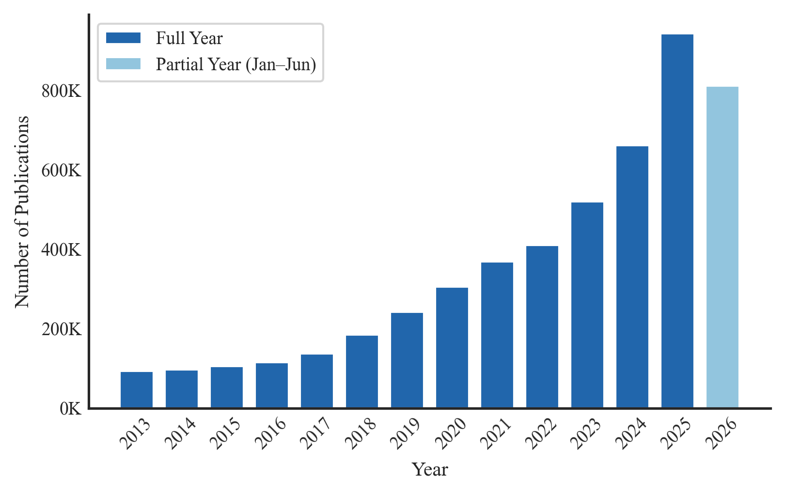
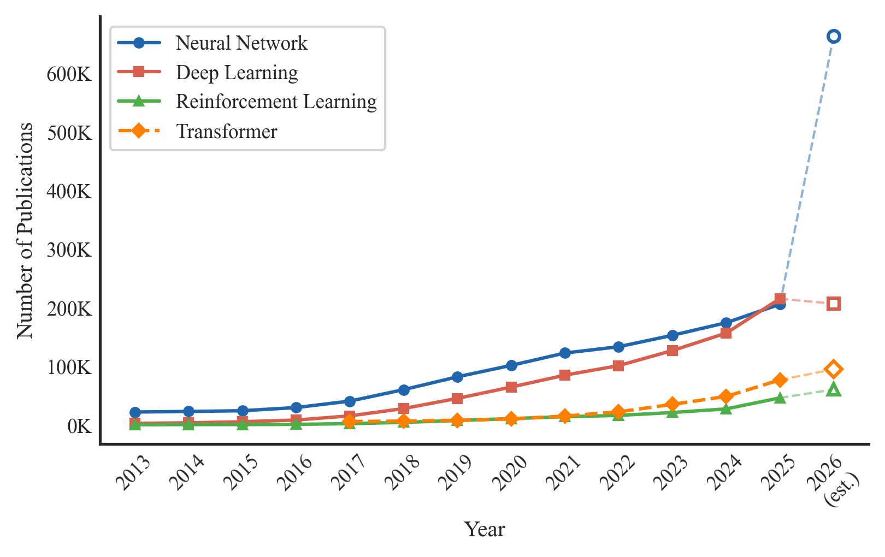
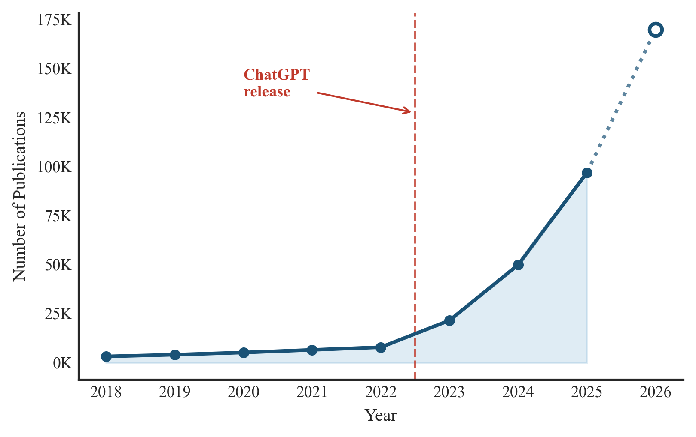
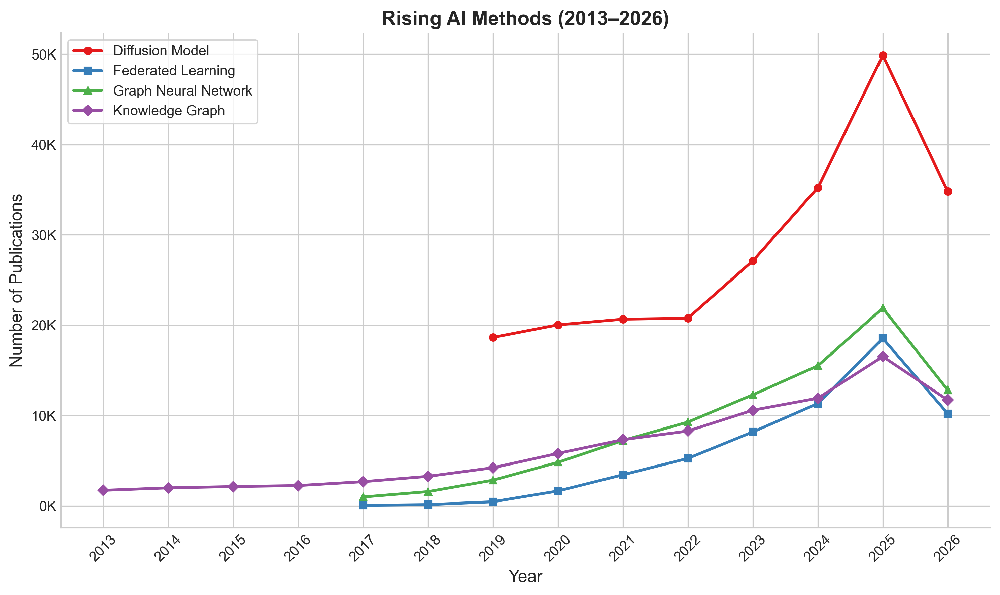
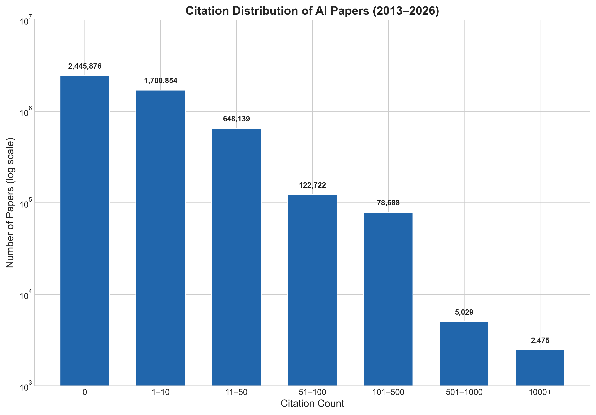
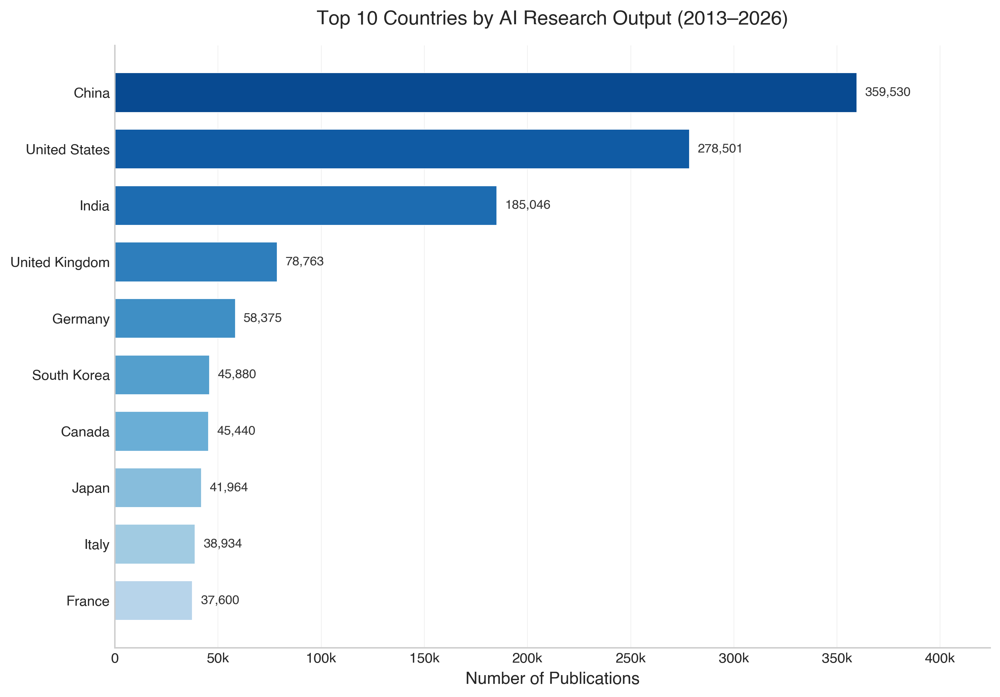
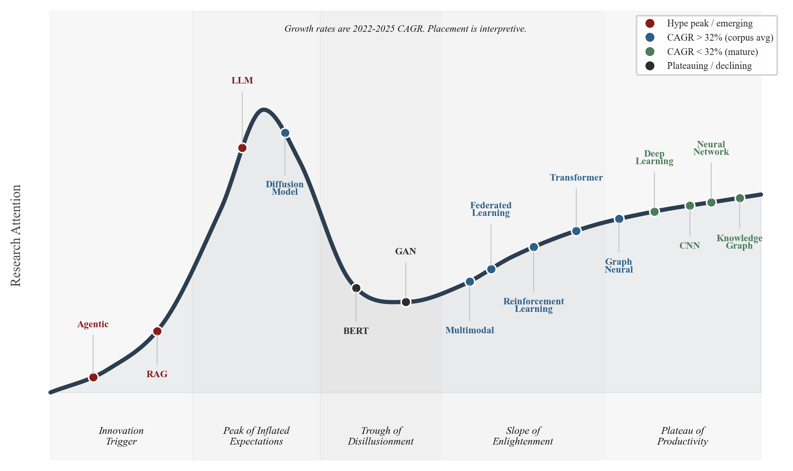
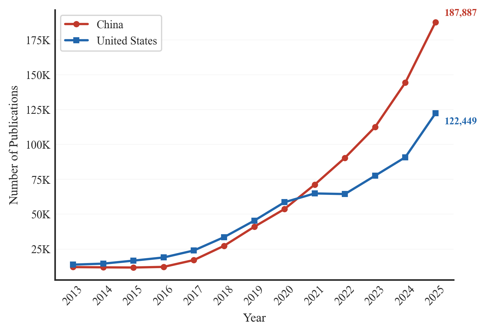
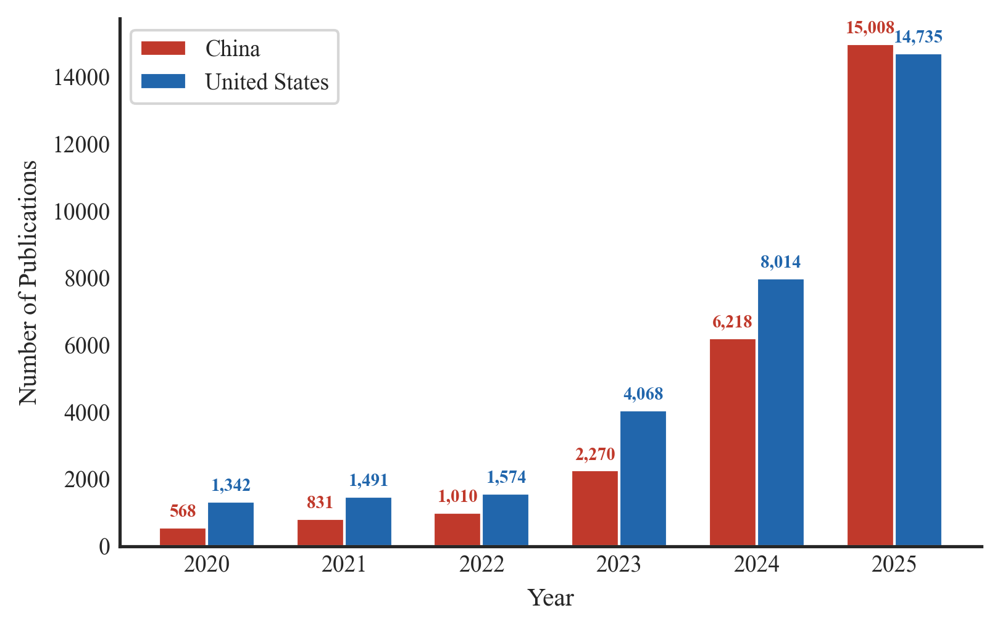

# State of AI Research

**Vedang Ratan Vatsa** 
*Founder, Hashtag Web3* 
*vedangvats@gmail.com* 

## Abstract

This study analyzes over five million academic papers that discuss artificial intelligence methods in their abstracts, published between 2013 and mid-2026. The analysis measures keyword frequency, temporal trajectories, growth rates, citation distributions, geographic concentration, institutional output, open access rates, and title-versus-abstract coverage gaps. Key findings include the continued dominance of neural networks across 30% of all abstracts, the 29.9x growth of large language model papers from 2018 to 2025, China exceeding the United States in total AI research volume by paper count, and nearly half of all papers receiving zero citations.

_**Keywords**_: artificial intelligence, machine learning, bibliometrics, research trends, large language models, neural networks, abstract analysis, OpenAlex

---

## 1. Introduction

In 2025, over 944,000 academic papers in the OpenAlex database mentioned artificial intelligence methods in their abstracts. Through early June 2026, 812,972 such papers have been recorded, putting the full year on pace for approximately 1.6 million total papers.

Many bibliometric studies of AI research rely on subject classification tags or curated keyword lists that may not capture cross-disciplinary usage of AI methods. When keyword search is used, title-based approaches capture only papers where the author chose to place the method name in the title. A paper titled "Predicting Protein Stability Under Thermal Stress" that uses a neural network throughout its methods section would be invisible to a title-only search for "neural network." Abstract-level analysis addresses this gap by searching the text where authors describe their methods, results, and contributions.

To analyze these trends, a bibliometric corpus of 5,003,783 publications was defined by querying the OpenAlex scholarly database for academic papers published between 2013 and mid-2026 that explicitly mention AI-related terms in their abstracts. No papers were downloaded; all analyses were performed through API count queries.

The analysis covers 14 annual cohorts (2013-2026), measuring publication volume, n-gram frequency, growth rates, citation distributions, geographic output, and open access rates, and compares abstract-level search against title-only search to quantify the coverage gap.

Section 2 describes the corpus definition and analysis methods. Section 3 presents results across nine dimensions. Section 4 discusses the findings. Section 5 reviews related work. Section 6 concludes.

## 2. Methodology

### 2.1 Data Source

OpenAlex is an open scholarly database indexing over 250 million academic works [1, 19]. It provides free API access with structured metadata including titles, abstracts (stored as inverted index), author affiliations, citation counts, open access status, and machine-learned concept tags. OpenAlex was chosen over Web of Science or Scopus because it is freely accessible, covers preprints (including arXiv), and exposes structured API filters that allow exact-count queries without downloading raw data.

### 2.2 Corpus Definition

The corpus was defined using OpenAlex's `abstract.search` filter. The search query combined 10 AI-related terms using boolean OR logic.

**Search terms.** *artificial intelligence, machine learning, deep learning, neural network, language model, reinforcement learning, computer vision, natural language, generative, autonomous.*

**Date range.** 2013-01-01 through 2026-06-08.

**Resulting corpus.** 5,003,783 papers.

Eight of the ten search terms are specific to AI. Two terms ("generative" and "autonomous") are broader and match non-AI papers. "Generative" can match generative grammar in linguistics. "Autonomous" can match autonomous systems in biology. Some fraction of the corpus consists of papers where the matched term refers to a non-AI context. This tradeoff was accepted because excluding these terms would miss entire AI research areas such as generative adversarial networks [10] (67,638 papers) and autonomous driving (71,930 papers).

**Table 1. Corpus composition by document type and source type.**

| Document Type | Count | Share | Source Type | Count | Share |
|---|---|---|---|---|---|
| Journal article | 3,270,717 | 65.4% | Journal | 2,232,178 | 44.6% |
| Preprint | 668,948 | 13.4% | Repository (arXiv, SSRN, etc.) | 1,370,590 | 27.4% |
| Book chapter | 386,449 | 7.7% | Book series | 246,842 | 4.9% |
| Dataset | 298,570 | 6.0% | Conference proceedings | 111,398 | 2.2% |
| Review | 94,567 | 1.9% | eBook platform | 69,676 | 1.4% |
| Dissertation | 92,581 | 1.9% | Other / unclassified | 973,099 | 19.5% |
| Other | 191,951 | 3.8% | | | |
| **Total** | **5,003,783** | | | | |

Repositories (primarily arXiv) account for 27.4% of the corpus, which is expected given how heavily AI researchers rely on preprints. Journals remain the largest single source at 44.6%.

### 2.3 Analysis Methods

All analyses were performed through direct OpenAlex API calls. No local text processing was applied.

1. **Keyword frequency.** For each keyword, bigram, or trigram of interest, a single API call was issued using `abstract.search:<term>,publication_year:2013-2026` and the `meta.count` field from the response was recorded.

2. **Growth detection.** For each keyword, the total publication count from 2025-2026 was divided by the total from 2022-2023 to produce a growth ratio.

3. **Time-series trajectories.** For 10 selected methods, year-by-year API calls were issued to obtain annual publication counts from 2013 (or the method's introduction year) through 2026.

4. **Citation distribution.** The `cited_by_count` filter was used to count papers in seven citation ranges (0, 1-10, 11-50, 51-100, 101-500, 501-1000, 1000+).

5. **Geographic and institutional analysis.** OpenAlex's `group_by` aggregation on `authorships.countries` and `authorships.institutions.lineage` was used to rank countries and institutions. A single paper with co-authors from multiple countries is counted once per country.

6. **Title vs. abstract comparison.** For 12 keywords, parallel queries were run using `title.search` and `abstract.search` and the ratio of abstract to title counts was computed.

### 2.4 Stemming and Precision

OpenAlex's search filters apply stemming, meaning a search for "agentic" also matches "agent" and "agents." For multi-word phrases ("retrieval augmented generation," "graph neural network") and proper nouns ("DeepSeek," "Claude," "Mistral"), stemming has minimal effect. For single common words ("diffusion," "safety," "clinical"), stemming can inflate counts by matching non-AI uses of the word. For example, searching "clinical" across all OpenAlex papers (2013-2026) returns 6,704,069 abstract matches, far exceeding the 5,003,783 papers in our AI-filtered corpus. Similarly, "agent" returns 2,179,789 matches, inflated by non-AI uses of the word in chemistry, pharmacology, and other fields. This limitation is discussed further in Section 4.5.

## 3. Results

### 3.1 Publication Volume

**Table 2. Annual publication volume (abstract-level corpus).**

| Year | Papers (Count) | YoY Growth | Cumulative Count | Share of Corpus |
|------|--------|-----------|------------|-------|
| 2013 | 93,226 | - | 93,226 | 1.9% |
| 2014 | 97,510 | +4.6% | 190,736 | 1.9% |
| 2015 | 105,609 | +8.3% | 296,345 | 2.1% |
| 2016 | 115,423 | +9.3% | 411,768 | 2.3% |
| 2017 | 137,237 | +18.9% | 549,005 | 2.7% |
| 2018 | 185,192 | +34.9% | 734,197 | 3.7% |
| 2019 | 242,286 | +30.8% | 976,483 | 4.8% |
| 2020 | 305,903 | +26.3% | 1,282,386 | 6.1% |
| 2021 | 369,519 | +20.8% | 1,651,905 | 7.4% |
| 2022 | 411,098 | +11.2% | 2,063,003 | 8.2% |
| 2023 | 520,861 | +26.7% | 2,583,864 | 10.4% |
| 2024 | 662,417 | +27.2% | 3,246,281 | 13.2% |
| 2025 | 944,530 | +42.6% | 4,190,811 | 18.9% |
| 2026 (up to June) | 812,972 | - | 5,003,783 | 16.2% |

The corpus grew from 93,226 papers in 2013 to 944,530 in 2025, a 10.1x increase over 12 years. The growth curve shows three distinct phases.

**Phase 1 (2013-2016), slow growth, 4.6-9.3% per year.** Annual output grew from 93,226 to 115,423 papers. Deep learning was still an active research area rather than a standard tool.

**Phase 2 (2017-2022), deep learning adoption, 11.2-34.9% per year.** Growth was fastest in 2017-2018 (+18.9% and +34.9%). The transformer architecture was introduced in 2017 [6], and deep learning frameworks (TensorFlow, PyTorch [20]) reached stable releases during this period, alongside widely adopted optimizers such as Adam [4]. Growth decelerated to 11.2% in 2022.

**Phase 3 (2023-2026), LLM-driven re-acceleration, 26.7-42.6% per year.** Starting in 2023, growth re-accelerated sharply. The 2025 output (944,530) represents a 42.6% increase over 2024, the highest annual growth rate since 2018. ChatGPT was released in November 2022, and the subsequent expansion of LLM-related research (Section 3.3) likely contributed to this re-acceleration.

The 2026 cohort (812,972 papers recorded through early June) is on pace to reach approximately 1.6 million publications for the full year based on linear extrapolation. If realized, this would be the first year in which annual output in this corpus exceeds 1 million papers.

The corpus is heavily weighted toward recent years. Papers published from 2023 onward account for 58.8% of the total, meaning that the majority of AI-related academic work indexed by OpenAlex is less than four years old.

### 3.2 N-gram Frequency

**Table 3. Top 10 bigrams and trigrams in abstracts.**

| Rank | Bigram | Mentions | Trigram | Mentions |
|------|--------|---|---------|-------|
| 1 | neural network | 1,522,612 | deep neural network | 518,431 |
| 2 | machine learning | 1,287,123 | convolutional neural network | 394,934 |
| 3 | deep learning | 980,070 | large language model | 292,873 |
| 4 | artificial intelligence | 745,358 | artificial neural network | 261,355 |
| 5 | attention mechanism | 432,079 | support vector machine | 239,347 |
| 6 | large language | 405,166 | natural language processing | 172,355 |
| 7 | image classification | 390,138 | long short-term memory | 137,359 |
| 8 | recommendation system | 387,638 | recurrent neural network | 88,266 |
| 9 | medical imaging | 359,104 | graph neural network | 86,453 |
| 10 | feature extraction | 256,159 | random forest classifier | 73,385 |

"Neural network" (1,522,612) dominates the list, appearing in 30.4% of all paper abstracts. "Machine learning" (1,287,123) and "deep learning" (980,070) round out the top three. Together, these three terms account for over 3.8 million abstract mentions in total (including duplicate counts where multiple terms appear in the same abstract).

"Attention mechanism" (432,079) ranks 5th. Attention-based architectures appear across NLP, computer vision, and multimodal tasks in this corpus, consistent with the transformer's influence since 2017 [6].

"Large language" (405,166) at rank 6 captures the LLM wave. It already surpasses older application-oriented terms such as "image classification" (390,138), "recommendation system" (387,638), and "medical imaging" (359,104).

"Feature extraction" (256,159) at rank 10 is a general-purpose term used across many machine learning pipelines.

"Deep neural network" (518,431) leads the trigrams, followed by "convolutional neural network" (394,934) [3]. Together these account for over 913,000 abstract mentions.

"Large language model" (292,873) at rank 3 has overtaken "artificial neural network" (261,355) and "support vector machine" (239,347). LLMs are discussed more broadly than title-only searches suggest (292,873 abstract mentions vs. 71,469 title mentions, a 4.1x ratio per Table 6).

"Support vector machine" (239,347) and "random forest classifier" (73,385) persist in the top 10. These classical methods continue to be widely referenced in abstracts, often as baselines for comparison or in application domains where simpler models remain competitive.

Both the bigram and trigram lists are top-heavy. The highest-ranked bigram (1,522,612) has 5.9x the count of the tenth (256,159), and the highest trigram (518,431) has 7.1x the count of the tenth (73,385). Five of the ten trigrams end in "network" (deep neural, convolutional neural, artificial neural, recurrent neural, graph neural), reflecting how many research areas have developed their own neural network variant. The bigram list splits between method-level terms in the top six (neural network through large language, totaling 5.37 million mentions) and application-level terms in the bottom four (image classification through feature extraction, totaling 1.39 million).

### 3.3 Time-Series Trajectories

**Foundational methods.** "Neural network" grew steadily from 23,395 abstract mentions in 2013 to 207,140 in 2025 (representing an 8.9x increase). "Deep learning" grew from 4,120 in 2013 to 216,713 in 2025 (a 52.6x increase). In 2025, "deep learning" surpassed "neural network" in annual abstract mentions for the first time (216,713 vs. 207,140), after closing the gap steadily from a 0.18 ratio in 2013 to 0.90 in 2024. "Reinforcement learning" grew from 1,784 in 2013 to 47,498 in 2025 (a 26.6x increase). "Transformer" grew from 7,201 abstract mentions in 2017 to 78,135 in 2025 (a 10.9x increase). The early counts (2017-2018) likely include non-AI uses of "transformer" (e.g., electrical engineering).

**The LLM trajectory.** "Large language model" abstract mentions grew from 3,248 in 2018 to 96,984 in 2025, representing a 29.9x increase. The growth curve has a clear inflection point. Between 2018 and 2022, mentions grew at a modest pace (from 3,248 to 7,931 mentions, or a 2.4x increase over four years). Between 2022 and 2025, mentions grew 12.2x in three years. The acceleration is visible year by year, jumping to 21,612 in 2023 (2.7x), 49,970 in 2024 (2.3x), and 96,984 in 2025 (1.9x). The annualized 2026 estimate (approximately 170,000 papers, based on 84,957 recorded through June) suggests another 1.8x increase over the 2025 volume. By 2025, LLM papers accounted for 10.3% of all AI papers in the corpus, up from 4.1% in 2023. No other method grew at a comparable rate over the same period. From 2022 to 2025, "transformer" grew 3.3x, "reinforcement learning" 2.7x, "deep learning" 2.1x, and "neural network" 1.5x.

In 2022, LLM papers were 1.9% of the corpus. By 2025, that share had grown to 10.3%. If the 2026 trajectory holds, roughly one in nine AI papers will mention large language models by year-end.

**Rising methods.** "Diffusion model" grew from 18,640 abstract mentions in 2019 to 49,862 in 2025 (a 2.7x increase). Early counts include non-AI uses of "diffusion model" (e.g., diffusion of innovations in social science). "Federated learning" [12] grew from 46 mentions in 2017 to 18,519 in 2025 (a 402.6x increase). "Graph neural" grew from 966 mentions in 2017 to 21,873 in 2025 (a 22.6x increase). "Knowledge graph" grew from 1,700 mentions in 2013 to 16,519 in 2025 (a 9.7x increase).

"Generative adversarial" grew from 6 papers in 2014 to 13,613 in 2025, totaling 67,638 papers across the corpus. Year-over-year growth peaked at 682% in 2017 and 189% in 2018, then fell to 4.5% in 2022 before settling at around 23% in 2024-2025. By comparison, "diffusion model" reached 49,862 annual mentions in 2025, 3.7x the GAN count that year. The lifecycle pattern is discussed in Section 4.3.

### 3.4 Fastest-Rising Keywords

**Table 4. Top 10 fastest-rising keywords in paper abstracts (2025-2026 vs. 2022-2023).**

| Keyword | 2025-2026 (Count) | 2022-2023 (Count) | Growth (Ratio) |
|---------|-----------|-----------|--------|
| deepseek | 11,033 | 13 | 848.7x |
| retrieval augmented generation | 18,196 | 347 | 52.4x |
| jailbreak | 2,803 | 110 | 25.5x |
| retrieval-augmented | 21,105 | 1,101 | 19.2x |
| mistral | 4,361 | 260 | 16.8x |
| llm | 161,771 | 10,125 | 16.0x |
| copilot | 5,699 | 356 | 16.0x |
| rag | 19,193 | 1,250 | 15.4x |
| gemini | 22,365 | 1,650 | 13.6x |
| guardrail | 5,046 | 521 | 9.7x |

The keyword growth data groups into three categories. Growth ratios were computed by dividing 2025-2026 abstract counts by 2022-2023 counts for each term (Section 2.3).

**Category 1, named models as research subjects.** "DeepSeek" (848.7x), "Mistral" (16.8x), and "Gemini" (13.6x) are all names of specific commercial models, not architectures or methods. Their presence in a fastest-rising keyword list suggests that researchers are spending more time evaluating and comparing named products.

**Category 2, the RAG pipeline.** "Retrieval augmented generation" (52.4x), "retrieval-augmented" (19.2x), and "RAG" (15.4x) all show rapid growth. Lewis et al. [8] introduced retrieval-augmented generation for knowledge-intensive NLP tasks, and the pattern has since been widely adopted. Its three variants in the growth table reflect how quickly researchers adopted it as both a technique and an abbreviation.

**Category 3, safety and reliability.** "Jailbreak" (25.5x) and "guardrail" (9.7x) reflect the growing research effort to make language models reliable and safe. "Jailbreak" research (2,803 papers in 2025-2026, up from 110 in 2022-2023) investigates adversarial prompts that circumvent model safety filters. "Guardrail" (5,046, up from 521) covers techniques for constraining model outputs.

All ten of the fastest-rising keywords are related to large language models. None involve computer vision, reinforcement learning, or graph methods. "Copilot" (16.0x), the remaining term in the table, refers to LLM-based assistants for coding (GitHub Copilot), productivity (Microsoft 365 Copilot), and other domains.

Growth ratios from small baselines should be read with caution. "DeepSeek" (848.7x) had only 13 papers in the 2022-2023 baseline. By absolute count, "LLM" (161,771 papers in 2025-2026) is the largest term in the table, and the three RAG variants total 58,494. This table captures where research attention is shifting, not what contributes the most new papers overall. Established methods like "deep learning" added 58,766 papers from 2024 to 2025, far more than any single term here.

### 3.5 Citation Distribution

The citation distribution is extremely right-skewed. Nearly half of all papers (48.9%) have received zero citations to date. Only 2,475 papers (0.05%) have accumulated more than 1,000 citations. Consequently, the median paper in this AI corpus has zero citations. This figure is partly inflated by recency, as papers published in 2024-2026 have had little time to accumulate citations.

The most-cited paper is ResNet [2] with 221,202 citations, approximately 1.9x the next entry. Several of the most-cited papers in the corpus, including the DSM-5 [23] (113,579 citations) and the lme4 statistics package [24] (84,949), are not AI research contributions but mention related methods in their abstracts, illustrating the breadth of abstract-level search. Among AI-specific papers, the top entries (ResNet, Deep Learning [5], AlexNet, VGGNet, Faster R-CNN, XGBoost) are all widely reused building blocks. Papers that provide such infrastructure receive orders of magnitude more citations than application-specific work.

### 3.6 Geographic Distribution

China leads with 874,019 publications, 21.6% higher than the United States (718,676). India ranks third with 369,931 publications, surpassing Japan (333,896) and the United Kingdom (216,177).

### 3.7 Institutional Output

**Table 5. Top 10 institutions by paper count.**

| Rank | Institution | Country | Papers (Count) | Share of Corpus |
|------|------------|---------|--------|-------|
| 1 | Chinese Academy of Sciences | China | 74,921 | 1.50% |
| 2 | CNRS (French Natl. Research Centre) | France | 50,145 | 1.00% |
| 3 | University of London | UK | 34,887 | 0.70% |
| 4 | Tsinghua University | China | 30,519 | 0.61% |
| 5 | Univ. of Chinese Academy of Sciences | China | 23,911 | 0.48% |
| 6 | Shanghai Jiao Tong University | China | 23,695 | 0.47% |
| 7 | Zhejiang University | China | 23,246 | 0.46% |
| 8 | Harvard University | US | 21,529 | 0.43% |
| 9 | US Department of Energy | US | 20,244 | 0.40% |
| 10 | Peking University | China | 20,127 | 0.40% |

The Chinese Academy of Sciences leads with 74,921 papers, 49.4% more than CNRS (50,145). Six of the top ten institutions are Chinese. Harvard (21,529) is the highest-ranked US institution at position 8.

OpenAlex's institution taxonomy includes umbrella organizations (CNRS, Helmholtz Association, US Department of Energy) alongside individual universities. These umbrella organizations aggregate papers from their constituent laboratories and institutes, which inflates their counts relative to standalone universities.

### 3.8 Open Access

Of the 5,003,783 papers in the corpus, 3,043,557 (60.8%) are published as open access (OA) literature, while 1,960,226 (39.2%) remain behind publisher paywalls. For context, Piwowar et al. [11] estimated the baseline open access rate across all academic fields at 28% in 2018. The higher rate in this corpus is consistent with the AI community's preprint culture, where arXiv is widely used to share work before formal publication.

### 3.9 Title vs. Abstract Comparison

**Table 6. Title-only vs. abstract search for selected keywords.**

| Keyword | Title Search | Abstract Search | Abstract Only | Ratio |
|---------|-----------|----------------|---------------|-------|
| neural network | 433,556 | 1,522,612 | 1,089,056 | 3.5x |
| machine learning | 495,798 | 1,287,123 | 791,325 | 2.6x |
| deep learning | 374,975 | 980,070 | 605,095 | 2.6x |
| large language model | 71,469 | 292,873 | 221,404 | 4.1x |
| diffusion model | 42,120 | 324,073 | 281,953 | 7.7x |
| transformer | 129,524 | 316,216 | 186,692 | 2.4x |
| hallucination | 10,711 | 48,759 | 38,048 | 4.6x |
| fairness | 78,835 | 429,288 | 350,453 | 5.4x |
| retrieval augmented | 8,137 | 27,394 | 19,257 | 3.4x |
| federated learning | 39,481 | 59,298 | 19,817 | 1.5x |
| reinforcement learning | 104,021 | 201,098 | 97,077 | 1.9x |
| knowledge graph | 28,201 | 90,234 | 62,033 | 3.2x |

The ratio of abstract-to-title matches varies from 1.5x ("federated learning") to 7.7x ("diffusion model"). "Diffusion model" (7.7x) is discussed in 324,073 abstracts but placed in the title of only 42,120 papers. However, as noted in Section 3.3, the abstract count for "diffusion model" includes non-AI uses (e.g., diffusion of innovations in social science), which inflates the ratio. The remaining high-ratio terms are more interpretable.

"Fairness" (5.4x) and "hallucination" (4.6x) also show high ratios. Both "fairness" and "hallucination" have significant non-AI uses. "Hallucination" appears in psychiatric and neuroscience literature, and "fairness" in social science and economics. The abstract counts for these two terms are inflated by non-AI papers, similar to "diffusion model."

"Federated learning" (1.5x) has the lowest ratio, meaning papers that discuss federated learning almost always include it in their title. This suggests that federated learning is typically the main contribution of the paper, not a supporting technique.

For bibliometric work, this means that title-only analysis systematically undercounts methods that are used as tools across disciplines, and abstract-level analysis captures more of that usage.

## 4. Discussion

### 4.1 The Persistence of Neural Networks

As shown in Section 3.2, "neural network" remains the most frequently referenced AI concept in the corpus, appearing in 30.4% of all abstracts. It holds this position despite public attention moving to large language models. The 3.5x ratio between abstract and title counts (Table 6) indicates that most papers using neural networks do not place the term in their titles. In this corpus, neural networks appear to function as a standard tool rather than a novel contribution. The temporal data (Section 3.3) shows steady 8.9x growth over 12 years, with the 2025 count (207,140) still higher than the 2024 count (175,688).

### 4.2 The LLM Inflection Point

The LLM trajectory (Section 3.3) shows the sharpest inflection in the corpus. No other method matches this acceleration profile. The fastest-rising keywords (Table 4) add context. The keyword data suggests that research activity has shifted from training LLMs to building systems around them. RAG (52.4x growth) is the clearest example of this shift. "Hallucination," "guardrail," and "jailbreak" indicate growing attention to reliability and safety.

The abbreviation "LLM" itself grew 16.0x (Table 4), which is consistent with the abbreviation becoming as common as the full phrase in abstracts.

### 4.3 Method Lifecycles

The time-series data (Section 3.3) places each method at a different lifecycle stage. The corpus as a whole grew 42.6% from 2024 to 2025, which serves as a baseline for comparing individual methods.

**Mature methods (steady growth).** "Neural network" grew 17.9% from 2024 to 2025, well below the corpus average. "Knowledge graph" grew 38.7%, closer to the average. Both have large cumulative totals and show no signs of decline.

**Growth phase.** "Deep learning" (+37.2%), "transformer" (+56.4%), "graph neural" (+41.1%), and "federated learning" (+63.6%) all grew faster than the corpus average in 2024-2025. "Federated learning" has the highest relative growth rate of this group, though its absolute count (18,519 in 2025) remains small compared to "deep learning" (216,713).

**Plateau candidates.** "Generative adversarial" year-over-year growth dropped from 33% in 2020 to 4.5% in 2022, before recovering to around 23% in 2024-2025. GANs are being supplemented by diffusion models for many image generation tasks. By 2025, "diffusion model" reached 3.7x the annual GAN count (49,862 vs. 13,613).

**Continued growth.** "Large language model" grew 94.1% from 2024 to 2025, more than double the corpus average. The annualized 2026 estimate (approximately 170,000 papers) suggests continued acceleration over the 2025 count of 96,984. These lifecycle patterns are summarized visually in Figure 7.

### 4.4 The China-US Research Balance

#### 4.4.1 The Crossover

China and the United States started the decade at near-parity. In 2013, the US produced 13,829 AI-related papers (by abstract count) while China produced 12,074. Both countries grew steadily through 2018, but their trajectories diverged after that.

**Table 7. Year-by-year AI research output for top 5 countries.**

| Year | China | United States | India | Japan | UK | China/US |
|------|-------|--------------|-------|-------|-----|----------|
| 2013 | 12,074 | 13,829 | 2,761 | 2,223 | 4,312 | 0.87 |
| 2014 | 11,897 | 14,551 | 3,445 | 2,277 | 4,557 | 0.82 |
| 2015 | 11,766 | 16,713 | 3,976 | 2,478 | 5,030 | 0.70 |
| 2016 | 12,229 | 18,988 | 4,996 | 2,913 | 5,762 | 0.64 |
| 2017 | 17,125 | 23,991 | 5,919 | 3,616 | 7,057 | 0.71 |
| 2018 | 27,353 | 33,567 | 8,592 | 5,075 | 9,567 | 0.81 |
| 2019 | 41,011 | 45,404 | 11,585 | 6,508 | 12,732 | 0.90 |
| 2020 | 53,743 | 58,622 | 17,612 | 7,712 | 16,574 | 0.92 |
| 2021 | 71,273 | 64,931 | 26,158 | 8,854 | 19,788 | **1.10** |
| 2022 | 90,485 | 64,486 | 35,760 | 9,420 | 19,798 | **1.40** |
| 2023 | 112,646 | 77,664 | 48,990 | 11,095 | 24,429 | **1.45** |
| 2024 | 144,452 | 90,915 | 65,398 | 12,657 | 28,174 | **1.59** |
| 2025 | 187,887 | 122,449 | 89,287 | 15,558 | 37,104 | **1.53** |

The crossover occurred in 2021. That year, China produced 71,273 papers while the US produced 64,931. US output fell slightly between 2021 and 2022 (64,931 to 64,486), while China continued to accelerate. By 2025, the gap had widened to 53.4% (187,887 vs. 122,449).

The US deceleration from 2020 to 2022 is notable. In this corpus, US output grew 10.0% over two years (58,622 to 64,486), compared to 68.4% growth for China over the same period (53,743 to 90,485). Growth resumed in the US from 2023 onward (77,664 to 122,449 by 2025, a 57.7% increase over two years), but not fast enough to close the gap.

Paper counts measure research volume, not research impact. This study does not analyze citation-weighted metrics, shares of top-1% highly cited papers, or venue prestige, which may yield different rankings. Publication incentive structures also differ across countries. Both China and the US have institutional pressures (tenure requirements, h-index targets, and ranking criteria) that can inflate output independently of research contribution.

#### 4.4.2 Method-Specific Comparisons

The China-US gap is not uniform across methods.

**Table 8. China vs. US paper counts by method (2013-2026, abstract search).**

| Method | China | US | Combined | China/US |
|--------|-------|------|-------|------|
| transformer | 89,302 | 33,506 | 122,808 | 2.67x |
| federated learning | 16,356 | 8,689 | 25,045 | 1.88x |
| neural network | 332,858 | 177,752 | 510,610 | 1.87x |
| deep learning | 241,216 | 140,965 | 382,181 | 1.71x |
| reinforcement learning | 50,910 | 31,277 | 82,187 | 1.63x |
| diffusion model | 66,832 | 56,315 | 123,147 | 1.19x |
| large language model | 35,923 | 47,363 | 83,286 | **0.76x** |

In the corpus, China leads in six of seven method categories. China's lead is strongest in "transformer" (2.67x), "federated learning" (1.88x), and "neural network" (1.87x). But the US leads in "large language model" (47,363 vs. 35,923, or 1.32x the Chinese count). While China produces more AI papers overall in the sample, the US produces more papers on the fastest-growing category since 2023.

The method-level shares within each country differ. "Neural network" appears in 38.1% of Chinese AI papers but 24.7% of US papers. "Transformer" appears in 10.2% of Chinese papers but only 4.7% of US papers. By contrast, "diffusion model" is nearly even as a share of each country's output (7.6% for China, 7.8% for the US), and "large language model" tilts toward the US (6.6% vs. 4.1%). The overall pattern is that China's volume lead is concentrated in established neural network methods, while the US has a proportionally larger share in LLM and diffusion model research.

#### 4.4.3 The LLM Convergence

The US led China in LLM research output throughout 2020-2024, with the gap narrowing overall, though it temporarily widened in 2023 before resuming its convergence. In 2020, the US produced 2.4x more LLM papers than China. By 2025, China reached parity (China: 15,008 vs. US: 14,735, a ratio of 1.02). Chinese LLMs such as DeepSeek-V3 [7], Qwen, and Yi were released during the same period, giving Chinese researchers domestic foundation models to study, benchmark, and extend.

From 2020-2022, the US produced more LLM papers than China. In 2023-2024, the gap narrowed as Chinese labs released competitive open-weight models. In 2025, Chinese LLM paper output matched the US for the first time.

#### 4.4.4 India's Acceleration

India shows a distinct growth pattern. In the corpus, Indian AI research output grew from 2,761 papers in 2013 to 89,287 in 2025, a 32.3x increase. This growth multiple is higher than both China (15.6x) and the US (8.9x) over the same period. India produced 89,287 AI papers in 2025, more than Japan (15,558) and the UK (37,104) combined.

India's growth rate has been accelerating. Between 2013 and 2018, Indian output grew 3.1x. Between 2018 and 2025, it grew 10.4x.

### 4.5 Limitations

**Stemming and noise.** OpenAlex applies stemming to search queries, which inflates counts for common words. "Explainable" returns 2,544,915 abstract matches, which is clearly inflated by stemming matching "explain" in non-AI contexts. Single-word keyword counts in Table 3 are best interpreted with this caveat in mind. Multi-word phrases and proper nouns are minimally affected.

**Cross-disciplinary noise.** As noted in Section 2.2, some fraction of the corpus consists of non-AI papers matching broad terms like "autonomous" or "generative." This is an inherent tradeoff of abstract-level analysis versus title-level analysis (which is more precise but less complete).

**Temporal coverage.** The 2026 cohort covers January through early June. Annualized projections assume even distribution throughout the year, which may not hold due to conference deadlines and journal publication cycles.

**Multi-counting.** A paper co-authored by researchers in China and the United States is counted once in each country's total. Country-level paper counts therefore sum to more than the corpus total. The same applies to institutions.

**OpenAlex coverage.** OpenAlex indexes over 250 million works but does not cover all academic literature. Non-English publications, conference proceedings from smaller venues, and technical reports may be underrepresented. OpenAlex has stronger coverage of English-language journals and repositories.

**Causation vs. correlation.** Growth in keyword frequency reflects research attention, not research quality or real-world deployment. A 16x increase in "LLM" papers does not mean LLMs are 16x more useful than they were in 2022.

**Volume vs. impact.** All country and institutional comparisons are based on paper counts, which measure volume, not impact. The caveats discussed in Section 4.4.1 (citation-weighted metrics, venue prestige, and differing publication incentive structures) apply to all geographic and institutional comparisons in this paper.

**Cross-disciplinary inclusion.** As noted in Section 3.5, the most-cited papers in the corpus include non-AI entries (e.g., DSM-5, lme4) whose abstracts happen to mention AI-related terms. This is an inherent feature of abstract-level search.

**No normalization against baseline.** The growth rates in this paper are raw, not normalized against overall academic publishing growth. Some of the observed AI growth reflects baseline expansion of scholarly output rather than AI-specific acceleration.

## 5. Related Work

### 5.1 AI Bibliometric Studies

The Stanford HAI AI Index Report [9] is a widely cited annual survey of AI research trends. The 2025 edition tracks publications, patents, investment, and policy across multiple data sources including Dimensions, Epoch, and LMSYS. This study differs in two ways. First, it uses abstract-level search rather than subject classification, capturing cross-disciplinary AI method usage. Second, every count in the analysis can be verified through the free OpenAlex API, rather than requiring access to proprietary databases.

The AI Index 2021 report [14] found that China and the US together dominated global AI publication output. In this corpus, China (874,019) and the US (718,676) together total 1,592,695 paper-country assignments (31.8% of the corpus total, though this figure is inflated by co-authored papers counted in both countries). The lower relative share compared to the AI Index reflects that this corpus includes a broader set of AI-adjacent documents beyond the core AI fields tracked by that report.

Jurowetzki et al. (2021) documented increasing overlap between academic and commercial AI development [15]. The growth of named models (DeepSeek, Gemini, Mistral) as the fastest-rising research terms in this corpus is consistent with that trend. Ahmed and Wahed (2020) examined the compute divide between industry and academic labs [18]. The title vs. abstract comparison (Table 6) adds a methodological datapoint, showing that abstract search captures 1.5x to 7.7x more papers per keyword than title-only search, consistent with standard recommendations for thorough search strategies [22].

### 5.2 Compute and Scaling Studies

Sevilla et al. (2022) analyzed compute trends in machine learning, documenting distinct scaling eras with doubling times ranging from 5-6 months in the deep learning era to approximately 10 months in the large-scale era [13]. The periods of fastest publication growth in this corpus (2017-2018 and 2023-2025) align with the periods when compute scaling enabled new model capabilities.

Hoffmann et al. (2022) introduced compute-optimal scaling laws ("Chinchilla scaling") [16], and Kaplan et al. (2020) characterized neural scaling laws [17]. The growth of "large language model" (29.9x from 2018 to 2025) tracks the research activity that followed, accelerated by models like GPT-3 [21].

## 6. Conclusion

Five million papers, analyzed through abstract-level keyword search, show three concurrent trends. Established methods (neural networks, deep learning, reinforcement learning) continue to dominate by accumulated volume. The LLM category has grown faster than any other method in this corpus (29.9x over seven years). And research on reliability and safety (hallucination, guardrail, jailbreak) has grown rapidly alongside deployment.

Six findings from this analysis.

1. **Neural networks remain dominant.** "Neural network" appears in 1,522,612 paper abstracts (30.4% of the corpus). This dominance has not diminished despite the attention given to LLMs. In 2025, "deep learning" surpassed "neural network" in annual abstract mentions for the first time (216,713 vs. 207,140), though "neural network" retains a larger cumulative total.

2. **LLMs are the fastest-growing category.** "Large language model" grew from 3,248 abstracts in 2018 to 96,984 in 2025 (29.9x), with an inflection point in 2022-2023 coinciding with the release of ChatGPT. By 2025, LLM papers accounted for 10.3% of the corpus, up from 1.9% in 2022.

3. **Research attention is shifting from architecture toward application.** The fastest-rising terms are not architectures but patterns (RAG, 52.4x), safety concepts (jailbreak, 25.5x), and specific model names (DeepSeek, 848.7x). All ten of the fastest-rising keywords in Table 4 are related to large language models.

4. **China leads in volume.** In the corpus, China produces 21.6% more AI research papers than the United States by paper count. China leads in six of seven method categories, but the US leads in "large language model" (1.32x the Chinese count). China reached LLM parity with the US in 2025. This study does not measure citation impact or venue prestige, which may yield different rankings.

5. **Half of all papers go uncited.** 48.9% of papers have zero citations, while only 2,475 papers (0.05%) have exceeded 1,000 citations. This figure is inflated by recent publications that have not yet had time to accumulate citations.

6. **Title-only analysis misses most AI research.** Abstract search captures 1.5x to 7.7x more papers per keyword, depending on the method. The abstract-to-title ratio is smallest for methods that are typically the main contribution of a paper (federated learning, 1.5x) and largest for terms with significant non-AI uses (diffusion model, 7.7x).

The methodological contribution of this study is that all results are derived from a single free API (OpenAlex) using abstract-level keyword search. Every count reported in this paper can be independently verified and updated. The corpus definition, search queries, and analysis methods are fully described in Section 2, making the analysis reproducible without access to proprietary databases.

Beyond these six findings, the sheer volume of AI-related publishing deserves attention. Within this corpus, more papers were published in 2025 alone (944,530) than in the first six years combined (2013-2018, 734,197). More than half of the corpus (58.8%) was published from 2023 onward. If the 2026 trajectory holds, this corpus will exceed 1.6 million papers in a single year. Part of this growth reflects AI methods spreading into fields that previously did not use them, and part reflects baseline growth in academic publishing overall (Section 4.5). The corpus does not distinguish between these two sources of growth.

Several questions remain outside the scope of this study. Citation-weighted analysis would reveal whether China's volume lead translates to proportional impact. Tracking author-level flows between academia and industry would extend the findings of Jurowetzki et al. [15]. Method co-occurrence analysis (which methods appear together in the same abstract) would show how researchers combine techniques. And longitudinal analysis of the 48.9% zero-citation papers would separate genuinely uncited work from papers that are simply too recent to have accumulated citations.

## References

[1] OpenAlex. "OpenAlex API Documentation." [https://docs.openalex.org](https://docs.openalex.org)

[2] K. He, X. Zhang, S. Ren, and J. Sun. "Deep Residual Learning for Image Recognition." CVPR, 2016. [https://arxiv.org/abs/1512.03385](https://arxiv.org/abs/1512.03385)

[3] O. Ronneberger, P. Fischer, and T. Brox. "U-Net: Convolutional Networks for Biomedical Image Segmentation." MICCAI, 2015. [https://arxiv.org/abs/1505.04597](https://arxiv.org/abs/1505.04597)

[4] D. P. Kingma and J. Ba. "Adam: A Method for Stochastic Optimization." ICLR, 2015. [https://arxiv.org/abs/1412.6980](https://arxiv.org/abs/1412.6980)

[5] Y. LeCun, Y. Bengio, and G. Hinton. "Deep Learning." Nature, vol. 521, pp. 436-444, 2015. [https://doi.org/10.1038/nature14539](https://doi.org/10.1038/nature14539)

[6] A. Vaswani et al. "Attention Is All You Need." NeurIPS, 2017. [https://arxiv.org/abs/1706.03762](https://arxiv.org/abs/1706.03762)

[7] DeepSeek-AI. "DeepSeek-V3 Technical Report." 2024. [https://arxiv.org/abs/2412.19437](https://arxiv.org/abs/2412.19437)

[8] P. Lewis et al. "Retrieval-Augmented Generation for Knowledge-Intensive NLP Tasks." NeurIPS, 2020. [https://arxiv.org/abs/2005.11401](https://arxiv.org/abs/2005.11401)

[9] Stanford HAI. "AI Index Report 2025." [https://aiindex.stanford.edu](https://aiindex.stanford.edu)

[10] I. Goodfellow et al. "Generative Adversarial Nets." NeurIPS, 2014. [https://arxiv.org/abs/1406.2661](https://arxiv.org/abs/1406.2661)

[11] H. Piwowar et al. "The State of OA: A Large-Scale Analysis of the Prevalence and Impact of Open Access Articles." PeerJ, 2018. [https://doi.org/10.7717/peerj.4375](https://doi.org/10.7717/peerj.4375)

[12] B. McMahan et al. "Communication-Efficient Learning of Deep Networks from Decentralized Data." AISTATS, 2017. [https://arxiv.org/abs/1602.05629](https://arxiv.org/abs/1602.05629)

[13] J. Sevilla et al. "Compute Trends Across Three Eras of Machine Learning." 2022. [https://arxiv.org/abs/2202.05924](https://arxiv.org/abs/2202.05924)

[14] D. Zhang et al. "The AI Index 2021 Annual Report." Stanford HAI, 2021. [https://aiindex.stanford.edu/report/](https://aiindex.stanford.edu/report/)

[15] R. Jurowetzki et al. "The Privatization of AI Research(-ers): Causes and Potential Consequences." 2021. [https://arxiv.org/abs/2102.01648](https://arxiv.org/abs/2102.01648)

[16] J. Hoffmann et al. "Training Compute-Optimal Large Language Models." NeurIPS, 2022. [https://arxiv.org/abs/2203.15556](https://arxiv.org/abs/2203.15556)

[17] J. Kaplan et al. "Scaling Laws for Neural Language Models." 2020. [https://arxiv.org/abs/2001.08361](https://arxiv.org/abs/2001.08361)

[18] N. Ahmed and M. Wahed. "The De-democratization of AI: Deep Learning and the Compute Divide in Artificial Intelligence Research." 2023. [https://arxiv.org/abs/2010.15581](https://arxiv.org/abs/2010.15581)

[19] J. Priem, H. Piwowar, and R. Orr. "OpenAlex: A fully-open index of scholarly works, authors, venues, institutions, and concepts." arXiv preprint arXiv:2205.01833, 2022. [https://arxiv.org/abs/2205.01833](https://arxiv.org/abs/2205.01833)

[20] A. Paszke et al. "PyTorch: An Imperative Style, High-Performance Deep Learning Library." NeurIPS, 2019. [https://arxiv.org/abs/1912.01703](https://arxiv.org/abs/1912.01703)

[21] T. B. Brown et al. "Language Models are Few-Shot Learners." NeurIPS, 2020. [https://arxiv.org/abs/2005.14165](https://arxiv.org/abs/2005.14165)

[22] C. Lefebvre et al. "Searching for studies." Cochrane Handbook for Systematic Reviews of Interventions, 2019. [https://doi.org/10.1002/9781119536604.ch4](https://doi.org/10.1002/9781119536604.ch4)

[23] American Psychiatric Association. "Diagnostic and Statistical Manual of Mental Disorders (DSM-5)." 5th ed., 2013. [https://doi.org/10.1176/appi.books.9780890425596](https://doi.org/10.1176/appi.books.9780890425596)

[24] D. Bates, M. Mächler, B. Bolker, and S. Walker. "Fitting Linear Mixed-Effects Models Using lme4." Journal of Statistical Software, vol. 67, no. 1, 2015. [https://doi.org/10.18637/jss.v067.i01](https://doi.org/10.18637/jss.v067.i01)
