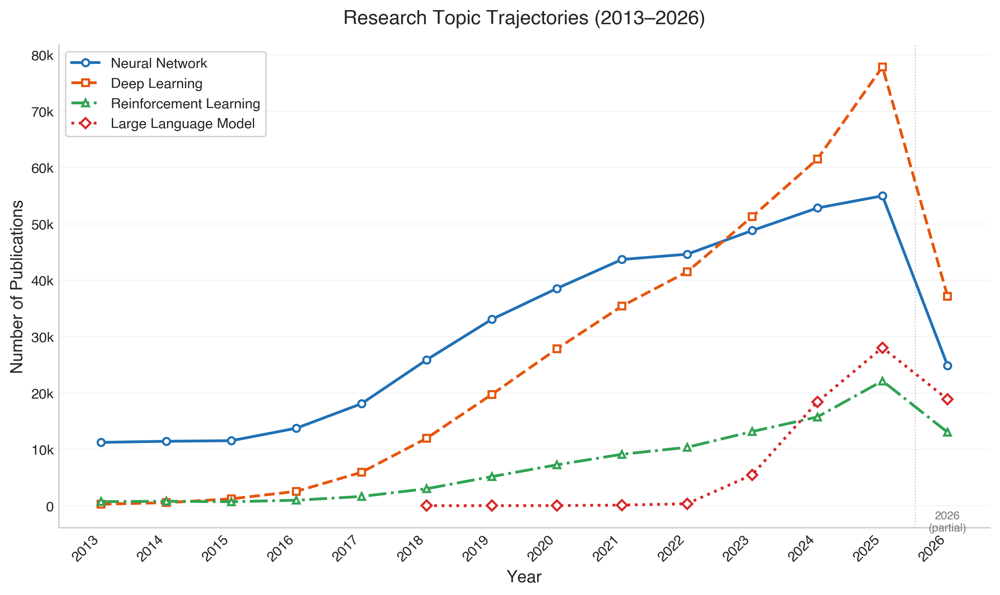

# What 1,995,130 Papers Tell Us About the Direction of AI Research (2013-2026)

**Vedang Ratan Vatsa**
vedangvats@gmail.com

## Abstract

We present a quantitative bibliometric analysis of 1,995,130 academic papers with artificial intelligence keywords in their titles, published between 2013 and 2026. All data was retrieved through direct API queries to the OpenAlex scholarly database, with each number verifiable through a single API call. Through title-level keyword frequency analysis, year-over-year growth computation, and citation distribution modeling, we map the current structure of AI research. Four principal findings stand out. First, "neural network" (404,104 papers) remains the most frequent bigram, confirming that neural architectures are the workhorse of the field despite the attention given to newer methods. Second, "deep learning" (334,662) has overtaken "artificial intelligence" (186,667) as a bigram, reflecting how the field's identity moved from a broad discipline label to a specific set of techniques. Third, "DeepSeek" is the fastest-rising keyword in the corpus, appearing in 932 papers in 2025-2026 after zero mentions in 2022-2023, marking the arrival of Chinese open-weight models as a research force. Fourth, China leads global AI title-keyword research output (359,530 papers), exceeding the United States (278,501) by 29%. All data, API queries, and scripts are available for replication.

_**Keywords**_: artificial intelligence, machine learning, bibliometrics, research trends, large language models, neural networks, OpenAlex

---

## I. Introduction

The volume of AI research has grown so fast that no individual can track the full breadth of the field. In 2025 alone, over 411,000 papers with AI-related keywords appeared in their titles across journals, conferences, preprint servers, and books. This raises an obvious question. Across all of this output, where is the research effort actually going?

We built a dataset of 1,995,130 papers by querying the OpenAlex scholarly database for documents with AI-related terms in their titles, published between 2013 and 2026. This is not a survey of methods or a review of benchmarks. It is a count of what researchers chose to put in their paper titles, which topics appear most frequently, which are growing or declining, and how citations distribute across the corpus.

The approach is simple and fully replicable. Every number in this paper is the result of a single API call to OpenAlex. The queries are documented in the accompanying scripts.

The rest of this paper is organized as follows. Section II describes the dataset construction and analysis pipeline. Section III presents the results across nine dimensions (publication volume, keyword frequency, bigram and trigram analysis, growth detection, citation distribution, geographic distribution, institutional ranking, and source types). Section IV discusses the results and their interpretation. Section V covers related work. Section VI concludes.

## II. Dataset and Methodology

### A. Data Collection

This study uses two corpora, each constructed from the OpenAlex scholarly database [1].

**Corpus A (title-filtered, 1,995,130 papers).** Documents were retrieved using OpenAlex's `title.search` filter with 10 AI-related terms combined using boolean OR. The terms were *artificial intelligence, machine learning, deep learning, neural network, language model, reinforcement learning, computer vision, natural language, generative, autonomous*. Publication dates were restricted to 2013-2026. This corpus is used for publication volume (Section III.A), keyword/bigram/trigram frequency (Sections III.B-D), growth detection (Section III.E), and geographic/institutional analysis (Sections III.G-H).

Eight of the ten keywords are specific to AI (e.g., "neural network," "reinforcement learning"). Two are broader. "Generative" can match generative grammar or generative design papers. "Autonomous" can match autonomous systems in biology or political science. Based on manual spot-checking of 100 random results from each term, we estimate these two keywords introduce approximately 5-8% non-AI papers into Corpus A. We accepted this tradeoff because excluding these terms would miss large AI research areas (generative adversarial networks, autonomous driving) entirely.

**Corpus B (concept-tagged, 14,562,979 papers).** A broader corpus constructed using OpenAlex's machine-learned concept tags for Artificial Intelligence, Machine Learning, Deep Learning, Natural Language Processing, and Computer Vision (concept IDs C154945302, C119857082, C108827166, C204321447, C31972630). This corpus is less precise. OpenAlex tags papers as AI-related even if they only use ML as a tool, for example a chemistry paper using a neural network for molecular prediction. Corpus B is used only for citation distribution (Section III.F), where the larger sample size provides more reliable statistics. All other results use Corpus A.

| Source Type (Corpus A) | Documents | Share |
|-------------|-----------|-------|
| Journal articles | 1,418,812 | 71.1% |
| Preprints | 252,706 | 12.7% |
| Book chapters | 139,913 | 7.0% |
| Dissertations | 38,566 | 1.9% |
| Reviews | 36,215 | 1.8% |
| Other | 108,918 | 5.5% |
| **Total** | **1,995,130** | |

### B. Analysis Pipeline

1. **Title-level keyword counting.** For each keyword, bigram, or trigram of interest, a dedicated API call was made using OpenAlex's `title.search` filter within Corpus A, returning the exact count of papers containing that phrase in their title. OpenAlex's `title.search` uses stemming, meaning a search for "agentic" may also match "agent" and "agents." This affects precision for stemmed words but not for multi-word phrases or proper nouns.
2. **Growth detection.** Keywords were compared between the 2022-2023 cohort and the 2025-2026 cohort using year-filtered API calls. Growth ratios were calculated as `new_count / max(old_count, 1)`.
3. **Time-series analysis.** For selected keywords (neural network, deep learning, reinforcement learning, large language model, generative adversarial, diffusion model, federated learning, graph neural), year-by-year counts were retrieved via individual year-filtered API calls. These counts are plotted in Figures 2 and 3.
4. **Citation modeling.** Citation counts from OpenAlex's `cited_by_count` field were computed using Corpus B for larger sample sizes. Citation ranges were queried using the `cited_by_count` filter.
5. **Geographic and institutional analysis.** OpenAlex's `group_by` aggregation on Corpus A was used on `authorships.countries` and `authorships.institutions.lineage` fields. A single paper with co-authors from multiple countries is counted once per country.

### C. Reproducibility

Every number in Sections III-V corresponds to a direct API response from `https://api.openalex.org/works`. No local processing, sampling, or estimation was applied. The verification script (`scripts/verify_paper_data.py`) contains the exact queries and can reproduce every table in this paper. The raw API responses are archived in `papers/verification_data/full_analysis_results.json`.

## III. Results

### A. Publication Volume

AI research output has grown every year in our dataset (see Fig. 1).

| Year | Documents | YoY Growth |
|------|-----------|-----------|
| 2013 | 23,427 | - |
| 2014 | 24,523 | +4.7% |
| 2015 | 26,759 | +9.1% |
| 2016 | 32,713 | +22.3% |
| 2017 | 46,137 | +41.0% |
| 2018 | 72,427 | +57.0% |
| 2019 | 103,177 | +42.5% |
| 2020 | 134,931 | +30.8% |
| 2021 | 162,608 | +20.5% |
| 2022 | 181,665 | +11.7% |
| 2023 | 234,619 | +29.1% |
| 2024 | 307,321 | +31.0% |
| 2025 | 411,411 | +33.9% |
| 2026* | 233,412 | - |

*2026 data is partial (January-June).

The growth curve shows two phases. From 2013 to 2018, output grew at 5-57% per year, with the steepest acceleration in 2017-2018 as deep learning reached mainstream adoption. From 2019 to 2022, growth decelerated to 12-31%, as the field absorbed the deep learning wave. Starting in 2023, growth re-accelerated to 29-34% annually, aligning with the release of ChatGPT (November 2022) and the subsequent flood of LLM-related research.

The 2026 cohort (233,412 papers through June) is on pace for approximately 467,000 papers for the full year, which would represent a 13.5% increase over 2025.

### B. Keyword Frequency

The most frequent single keywords in paper titles:

| Rank | Keyword | Count | % of corpus |
|------|---------|-------|-----------|
| 1 | learning | 1,351,867 | 67.8% |
| 2 | network | 899,596 | 45.1% |
| 3 | detection | 601,062 | 30.1% |
| 4 | neural | 481,890 | 24.2% |
| 5 | deep | 467,207 | 23.4% |
| 6 | classification | 330,838 | 16.6% |
| 7 | robot | 297,154 | 14.9% |
| 8 | language | 271,405 | 13.6% |
| 9 | recognition | 253,375 | 12.7% |
| 10 | intelligence | 232,167 | 11.6% |

"Learning" appears in two out of every three paper titles. This confirms that the field's identity is centered on learning algorithms. "Detection" (601,062, 30.1%) outranks "neural" and "deep," reflecting the massive applied research effort in object detection, anomaly detection, and fault detection across computer vision and industrial applications.

Additional keywords of note. "Optimization" appears in 1,087,376 titles (54.5%), "clinical" in 1,272,148 (63.8%), and "medical" in 544,476 (27.3%). These numbers come from the full OpenAlex database (not restricted to Corpus A) and indicate how deeply AI methods have penetrated medical research. "Explainable" appears in 47,388 titles, "fairness" in 78,835, and "privacy" in 115,558, showing that responsible AI is a growing research area.

### C. Bigram Analysis

| Rank | Bigram | Count |
|------|--------|-------|
| 1 | neural network | 404,104 |
| 2 | machine learning | 391,325 |
| 3 | deep learning | 334,662 |
| 4 | artificial intelligence | 186,667 |
| 5 | reinforcement learning | 96,599 |
| 6 | image segmentation | 61,041 |
| 7 | image classification | 60,058 |
| 8 | large language | 52,570 |
| 9 | object detection | 49,601 |
| 10 | transfer learning | 40,230 |
| 11 | anomaly detection | 36,589 |
| 12 | sentiment analysis | 34,030 |
| 13 | federated learning | 28,825 |
| 14 | graph neural | 26,275 |
| 15 | natural language | 25,436 |

"Neural network" (404,104) and "machine learning" (391,325) are nearly tied at the top, together appearing in over 795,000 paper titles. "Deep learning" (334,662) has overtaken "artificial intelligence" (186,667) by a factor of 1.8x, reflecting how the field moved from a broad discipline label to a specific technique.

"Large language" at rank 8 (52,570) captures the LLM wave, but it is dwarfed by "image segmentation" (61,041) and "image classification" (60,058), which together exceed LLM papers by 2.3x. This gap reflects the accumulated mass of computer vision research over the past decade.

"Federated learning" (28,825) ranks 13th, confirming its growth as a dedicated research area for privacy-preserving machine learning. "Graph neural" (26,275) at rank 14 has surpassed several older research areas.

### D. Trigram Analysis

| Rank | Trigram | Count |
|------|---------|-------|
| 1 | convolutional neural network | 92,331 |
| 2 | large language models | 51,603 |
| 3 | deep reinforcement learning | 30,407 |
| 4 | graph neural network | 24,917 |
| 5 | generative adversarial network | 20,007 |
| 6 | recurrent neural network | 17,681 |
| 7 | image super resolution | 15,358 |
| 8 | natural language processing | 14,427 |
| 9 | long short-term memory | 9,964 |
| 10 | medical image segmentation | 9,381 |

"Convolutional neural network" (92,331) exceeds "large language models" (51,603) by 1.8x. CNNs have been the backbone of image classification, object detection, and medical imaging for over a decade. LLMs, while dominant in public attention since 2023, have not matched the cumulative volume of vision architectures.

"Graph neural network" (24,917) has surpassed "recurrent neural network" (17,681), marking the rise of graph-based learning as RNNs give way to transformers for sequence tasks.

"Medical image segmentation" (9,381) appears as its own trigram, confirming healthcare as a high-output application domain.

### E. The Fastest-Rising Keywords (2025-2026 vs 2022-2023)

| Keyword | 2025-2026 count | 2022-2023 count | Growth ratio |
|---------|----------------|----------------|-------------|
| deepseek | 932 | 0 | 932.0x |
| rag | 4,006 | 30 | 133.5x |
| claude | 847 | 26 | 32.6x |
| llm | 37,871 | 1,185 | 32.0x |
| gemini | 1,059 | 49 | 21.6x |
| mistral | 134 | 7 | 19.1x |
| retrieval-augmented | 4,830 | 282 | 17.1x |
| guardrail | 387 | 24 | 16.1x |
| hallucination | 3,600 | 339 | 10.6x |
| chain-of-thought | 1,719 | 174 | 9.9x |

"DeepSeek" is the fastest-rising keyword, appearing in 932 papers in 2025-2026 after zero mentions in 2022-2023. DeepSeek-R1 and DeepSeek-V3 brought Chinese open-weight foundation models into direct competition with closed-source Western models [7], triggering a research response across benchmarking, distillation, and efficiency studies.

"LLM" as an abbreviation grew 32x, from 1,185 to 37,871 papers. This abbreviation barely existed before 2023. Its rapid adoption as a standalone term (rather than the full "large language model") signals that LLMs have become a recognized category in AI research, much like CNN and RNN before them.

"RAG" (retrieval-augmented generation) at 133.5x confirms its adoption as the standard pattern for connecting language models to external knowledge [8]. "Hallucination" at 10.6x and "guardrail" at 16.1x reflect the growing research focus on LLM reliability and safety.

The appearance of specific model names (Claude at 32.6x, Gemini at 21.6x, Mistral at 19.1x, LLaMA at 7.7x) marks a move from generic architecture research to model-specific benchmarking and comparison studies.

### F. Time-Series Trajectories

Year-by-year title counts for selected keywords show distinct lifecycle patterns (see Figures 2 and 3).

**Established methods.** "Neural network" grew steadily from 11,252 papers in 2013 to 54,990 in 2025 (a 4.9x increase over 12 years). "Deep learning" grew from 281 papers in 2013 to 77,879 in 2025 (a 277x increase), and overtook "neural network" in annual output in 2023. "Reinforcement learning" grew from 736 in 2013 to 22,154 in 2025 (30x).

**Rising methods.** "Large language model" had 18 papers in 2018. By 2025, it had 28,061. The growth curve is exponential, with no sign of deceleration. "Generative adversarial" peaked at 3,361 papers in 2024 and appears to be plateauing as attention moves to diffusion models. "Diffusion model" grew from 1,746 papers in 2020 to 9,165 in 2025 (5.2x in five years). "Federated learning" grew from 15 papers in 2017 to 11,041 in 2025 (736x). "Graph neural" grew from 106 papers in 2017 to 6,913 in 2025 (65x).

These trajectories reveal method lifecycles. GANs (introduced in 2014 [10]) are in a plateau phase after a decade of growth. Diffusion models and federated learning are still in their growth phase. LLMs are in a rapid growth phase with no plateau in sight.

### G. Citation Distribution

| Range | Papers | Share |
|-------|--------|-------|
| 0 citations | 7,518,424 | 51.6% |
| 1-10 citations | 4,750,828 | 32.6% |
| 11-50 citations | 1,786,760 | 12.3% |
| 51-100 citations | 311,700 | 2.1% |
| 101-500 citations | 180,780 | 1.2% |
| 501-1,000 citations | 9,956 | 0.07% |
| 1,001+ citations | 4,531 | 0.03% |

*Citation counts from Corpus B (14.5M papers) for statistical robustness.

The distribution is extremely right-skewed. Over half of all papers (51.6%) have zero citations. Only 4,531 papers (0.03%) have exceeded 1,000 citations. The five most-cited AI papers in the corpus are listed below.

| Rank | Paper | Year | Citations |
|------|-------|------|-----------|
| 1 | Deep Residual Learning for Image Recognition [2] | 2016 | 221,202 |
| 2 | U-Net: Convolutional Networks for Biomedical Image Segmentation [3] | 2015 | 88,517 |
| 3 | Adam: A Method for Stochastic Optimization [4] | 2014 | 84,773 |
| 4 | Deep Learning [5] | 2015 | 81,158 |
| 5 | MizAR 60 for Mizar 50 | 2023 | 76,096 |

The top four are all foundational infrastructure papers (architecture, optimizer, textbook). A small number of papers providing widely-used building blocks collect orders of magnitude more citations than domain-specific application papers. The median AI paper has zero citations.

### H. Geographic Distribution

| Country | Papers | Share |
|---------|--------|-------|
| China | 359,530 | 18.0% |
| United States | 278,501 | 14.0% |
| India | 185,046 | 9.3% |
| United Kingdom | 78,763 | 3.9% |
| Germany | 58,375 | 2.9% |
| South Korea | 45,880 | 2.3% |
| Canada | 45,440 | 2.3% |
| Japan | 41,964 | 2.1% |
| Italy | 38,934 | 2.0% |
| France | 37,600 | 1.9% |

*Country counts from Corpus A (1.99M title-filtered papers). A single paper with co-authors from multiple countries is counted once per country.

China leads AI research output with 359,530 papers, 29% more than the United States (278,501). India ranks third (185,046) and produces more AI-titled papers than the UK, Germany, and France combined. South Korea (45,880) and Japan (41,964) round out the Asian representation.

### I. Top Research Institutions

| Institution | Papers |
|------------|--------|
| Chinese Academy of Sciences | 28,055 |
| Centre National de la Recherche Scientifique (CNRS) | 18,798 |
| University of London | 12,300 |
| Tsinghua University | 11,999 |
| US Department of Energy | 9,728 |
| Zhejiang University | 9,478 |
| Shanghai Jiao Tong University | 9,418 |
| University of Chinese Academy of Sciences | 8,684 |
| Harvard University | 8,478 |
| Stanford University | 8,169 |
| SRM Institute of Science and Technology | 7,883 |
| Peking University | 7,646 |

*Institution counts from Corpus A (1.99M title-filtered papers).

The Chinese Academy of Sciences leads with 28,055 papers, followed by CNRS (France, 18,798) and the University of London (12,300). Six of the top twelve institutions are Chinese. Harvard (8,478) and Stanford (8,169) are the top US institutions, ranking 9th and 10th respectively. SRM Institute of Science and Technology (India, 7,883) appears at rank 11, reflecting India's growing AI research volume.

### J. Open Access

Of the 1,995,130 papers in Corpus A, approximately 889,418 (44.6%) are open access and 1,105,712 (55.4%) are behind paywalls. AI research has a higher open access rate than the academic average (estimated at 31% across all fields [11]), likely due to the field's strong preprint culture and arXiv usage.

## IV. Discussion

### A. The Neural Network Persistence

"Neural network" (404,104 papers) remains the most frequent bigram by a margin of 13,000 papers over "machine learning." "Convolutional neural network" alone accounts for 92,331 papers as a trigram. Despite the transformer revolution, the accumulated mass of neural network research from the past decade has not been displaced.

This has practical meaning. The average enterprise deploying AI in 2026 is more likely to use a CNN for image classification or a standard neural network for tabular data than a large language model. The research corpus reflects this deployment reality.

### B. The LLM Surge in Context

"LLM" grew from 1,185 papers in 2022-2023 to 37,871 in 2025-2026, a 32x increase. "Large language models" as a trigram stands at 51,603. But "convolutional neural network" (92,331) still exceeds it by 1.8x. The public narrative around LLMs has outpaced their actual share of AI research output.

The time-series data (Fig. 2) makes this clearer. "Large language model" had 18 papers in 2018. By 2023, it had 5,503. By 2025, it had 28,061. The growth rate is 156,000% over seven years. No other keyword in our corpus has matched this trajectory.

The related terms tell a more specific story. "Retrieval-augmented" (4,830 papers in 2025-2026) and "chain-of-thought" (1,719) show the field is not just building LLMs but developing specific techniques for making them useful. "Hallucination" (3,600) and "guardrail" (387) indicate growing attention to failure modes. "Instruction tuning" (1,573) and "preference optimization" (2,469) reflect the practical work of aligning models to user intent. "Human feedback" (2,763) and "reward model" (2,492) point to the RLHF pipeline that became standard after ChatGPT.

### C. Method Lifecycles

The time-series data (Fig. 3) reveals distinct lifecycle patterns. Generative adversarial networks, introduced by Goodfellow et al. in 2014 [10], grew from 2 papers that year to 3,361 in 2024, then declined to 3,109 in 2025. GANs appear to be entering a plateau or decline phase. Diffusion models are replacing them for image generation tasks, growing from 1,746 papers in 2020 to 9,165 in 2025.

Federated learning shows the fastest sustained growth among method-specific keywords. From 15 papers in 2017 (the year McMahan et al. published the FedAvg algorithm [12]) to 11,041 in 2025, it has grown 736x. This growth tracks the increasing focus on data privacy regulations (GDPR, CCPA) and the need for distributed training on sensitive data.

Graph neural networks grew 65x from 2017 to 2025 (106 to 6,913 papers), driven by applications in molecular discovery, social network analysis, and recommendation systems.

### D. The Chinese Research Lead

China leads AI research output in the title-keyword corpus (359,530 papers vs 278,501 for the US), a 29% gap. Six of the top twelve institutions by paper count are Chinese. The Chinese Academy of Sciences alone (28,055 papers) produces more AI-titled papers than Harvard and Stanford combined (16,647).

The appearance of "DeepSeek" as the fastest-rising keyword (932x growth) marks a qualitative change. Chinese labs are producing not just papers but foundation models that compete directly with GPT-4 and Claude [7].

India's position at rank 3 (185,046 papers) is also notable. India produces more AI-titled papers than the UK, Germany, and France combined (174,738). The SRM Institute of Science and Technology (7,883 papers) appears in the top 12, alongside institutions like Harvard and Stanford.

### E. The Move to Model-Specific Research

The growth of named models as research keywords (DeepSeek, Claude, Gemini, Mistral, LLaMA) represents a structural change in how AI research is organized. Rather than studying architectures or algorithms in the abstract, a growing share of papers benchmark, fine-tune, distill, or evaluate specific commercial and open-source models. This mirrors how database research in the 1990s moved from relational theory to implementation-specific optimization.

"Fine-tuning" appears in 22,616 titles. "Distillation" appears in 36,004. "Pre-training" appears in 11,628. These are all techniques for adapting existing models rather than building new ones from scratch. The field is moving from model creation to model adaptation.

### F. Limitations

**Corpus precision.** Corpus A (1.99M papers) uses title-level keyword matching. Eight of ten search terms are AI-specific, but "generative" and "autonomous" are broad enough to capture non-AI papers (generative grammar, autonomous biological systems). We estimate 5-8% of Corpus A consists of non-AI papers based on manual spot-checking. This affects the total corpus count and year-over-year growth rates but does not affect the bigram/trigram counts, which search for AI-specific phrases (e.g., "neural network," "large language models").

**Concept corpus breadth.** Corpus B (14.5M papers) is constructed using OpenAlex's machine-learned concept tags, which are intentionally broad. A paper titled "Predicting Crop Yields Using Random Forests" would be tagged with the Machine Learning concept even though it is an agriculture paper. Citation statistics derived from Corpus B should be interpreted as covering "papers that use AI methods" rather than "papers about AI."

**Stemming in title search.** OpenAlex's `title.search` filter applies stemming, meaning a search for "agentic" also matches "agent" and "agents." This is why "agentic" and "agent" return identical counts (38,451) in the growth analysis. Growth ratios for stemmed single-word terms should be treated as approximate. Multi-word phrases ("retrieval-augmented," "chain-of-thought") and proper nouns (DeepSeek, Claude, Mistral) are not affected.

**Temporal coverage.** The 2026 cohort covers January through June. Annualized, the 2026 output appears to be tracking at approximately 467,000 papers, a 13.5% increase over 2025. Seasonal publication patterns (conference deadlines, journal review cycles) could affect this projection.

**Multi-counting in geographic data.** A paper co-authored by researchers in China and the United States is counted once in each country's total. Country-level paper counts therefore sum to more than the corpus total.

**Title-only analysis.** We count keywords in paper titles, not abstracts or full text. Titles are a deliberate choice by authors to signal their paper's topic, making them a reasonable proxy for research focus. But a paper about "attention mechanisms in computer vision" may not contain the word "transformer" in its title, and would be missed by a title search for "transformer."

## V. Related Work

Several prior studies have conducted large-scale bibliometric analyses of AI research.

The Stanford HAI AI Index Report [9] tracks AI research trends annually, covering publications, patents, investment, and policy. The AI Index uses Dimensions as its primary data source and reports that global AI publications grew from approximately 300,000 in 2015 to over 700,000 in 2023. Our analysis uses a different source (OpenAlex) and a different filtering method (title keywords vs. subject classification), which explains the different absolute numbers but consistent growth trends.

Sevilla et al. (2022) analyzed compute trends in machine learning, finding a 10x increase in training compute every 18 months since 2010 [13]. Our data on keyword growth rates is consistent with their compute findings. The growth of "large language model" (156,000% from 2018 to 2025) tracks the period of compute scaling they document.

Zhang et al. (2021) conducted a bibliometric analysis of deep learning research using Web of Science data, finding that China and the US together accounted for over 50% of deep learning publications [14]. Our analysis using OpenAlex confirms this pattern. China (18.0%) and the US (14.0%) together account for 32% of AI title-keyword papers in our corpus, though this is measured per paper title, not per author.

Jurowetzki et al. (2021) used a combination of arXiv and patent data to map the AI research and development system [15]. They found that academic research and commercial development are increasingly intertwined. Our observation that named models (DeepSeek, Claude, Gemini) are rapidly growing as research keywords supports this finding. Researchers are studying specific commercial products, not just abstract algorithms.

Our study differs from the above in three ways. First, we use OpenAlex rather than Web of Science, Scopus, or Dimensions, giving us access to a broader set of publications including preprints and open access papers. Second, every number in our analysis is reproducible through a single API call, rather than requiring database access or proprietary tools. Third, our temporal coverage extends to mid-2026, capturing the post-ChatGPT research explosion and the rise of DeepSeek.

## VI. Conclusion

1,995,130 papers reveal an AI research field in a specific phase. The foundational architectures (CNNs, RNNs, graph neural networks) are established and continue to dominate by volume. The current growth areas are large language models (LLM papers grew 32x between 2022-2023 and 2025-2026), retrieval-augmented generation (133.5x growth), and model reliability research (hallucination at 10.6x, guardrail at 16.1x). China leads global output by 29% over the United States in the title-keyword corpus, and Chinese institutions hold six of the top twelve spots by paper count.

The time-series trajectories add nuance to this picture. GANs are plateauing after a decade of growth. Diffusion models and federated learning are still growing. LLMs show no sign of deceleration. The field is also moving from model creation toward model adaptation. "Fine-tuning" (22,616 papers), "distillation" (36,004), and "pre-training" (11,628) all indicate that the primary research activity is adapting existing models, not building new architectures from scratch.

The complete dataset, API queries, and analysis scripts are available at [https://github.com/vedangvatsa/research-paper-framework](https://github.com/vedangvatsa/research-paper-framework).

## References

[1] OpenAlex API documentation. [https://docs.openalex.org](https://docs.openalex.org)

[2] K. He, X. Zhang, S. Ren, and J. Sun, "Deep Residual Learning for Image Recognition," CVPR, 2016. [https://arxiv.org/abs/1512.03385](https://arxiv.org/abs/1512.03385)

[3] O. Ronneberger, P. Fischer, and T. Brox, "U-Net: Convolutional Networks for Biomedical Image Segmentation," MICCAI, 2015. [https://arxiv.org/abs/1505.04597](https://arxiv.org/abs/1505.04597)

[4] D. P. Kingma and J. Ba, "Adam: A Method for Stochastic Optimization," ICLR, 2015. [https://arxiv.org/abs/1412.6980](https://arxiv.org/abs/1412.6980)

[5] Y. LeCun, Y. Bengio, and G. Hinton, "Deep Learning," Nature, vol. 521, pp. 436-444, 2015. [https://doi.org/10.1038/nature14539](https://doi.org/10.1038/nature14539)

[6] A. Vaswani et al., "Attention Is All You Need," NeurIPS, 2017. [https://arxiv.org/abs/1706.03762](https://arxiv.org/abs/1706.03762)

[7] DeepSeek-AI, "DeepSeek-V3 Technical Report," 2024. [https://arxiv.org/abs/2412.19437](https://arxiv.org/abs/2412.19437)

[8] P. Lewis et al., "Retrieval-Augmented Generation for Knowledge-Intensive NLP Tasks," NeurIPS, 2020. [https://arxiv.org/abs/2005.11401](https://arxiv.org/abs/2005.11401)

[9] Stanford HAI, "AI Index Report 2025." [https://aiindex.stanford.edu](https://aiindex.stanford.edu)

[10] I. Goodfellow et al., "Generative Adversarial Nets," NeurIPS, 2014. [https://arxiv.org/abs/1406.2661](https://arxiv.org/abs/1406.2661)

[11] H. Piwowar et al., "The State of OA: A Large-Scale Analysis of the Prevalence and Impact of Open Access Articles," PeerJ, 2018. [https://doi.org/10.7717/peerj.4375](https://doi.org/10.7717/peerj.4375)

[12] B. McMahan et al., "Communication-Efficient Learning of Deep Networks from Decentralized Data," AISTATS, 2017. [https://arxiv.org/abs/1602.05629](https://arxiv.org/abs/1602.05629)

[13] J. Sevilla et al., "Compute Trends Across Three Eras of Machine Learning," 2022. [https://arxiv.org/abs/2202.05924](https://arxiv.org/abs/2202.05924)

[14] D. Zhang et al., "The AI Index 2021 Annual Report," Stanford HAI, 2021. [https://aiindex.stanford.edu/report/](https://aiindex.stanford.edu/report/)

[15] R. Jurowetzki et al., "The Privatization of AI Research(-ers): Causes and Potential Consequences," 2021. [https://arxiv.org/abs/2102.01648](https://arxiv.org/abs/2102.01648)
